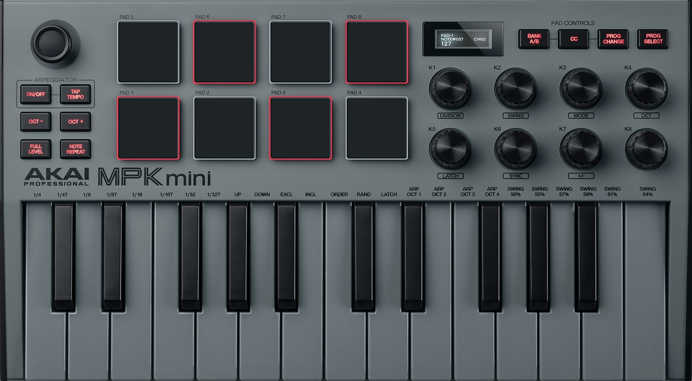

  <picture>
    <source srcset="assets/MPK_Mini.jpg" media="(prefers-color-scheme: dark)">
    <source srcset="assets/MPK_Mini.jpg" media="(prefers-color-scheme: light)">
    
  </picture>

# MIDI Control #1
MIDI synth voice plugin using the JUCE C++ framework

See the full design document in [architecture.md](docs/architecture.md).
