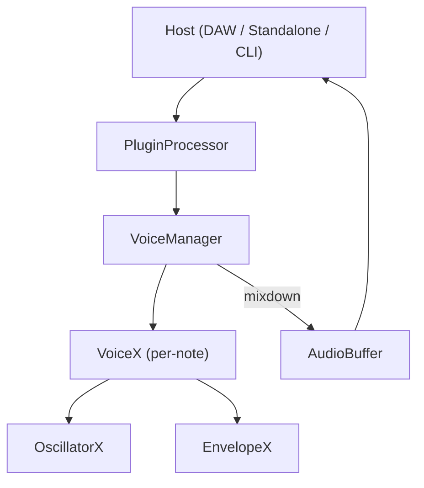

<p align="left">
  <picture>
    <source srcset="assets/MPK_Mini.jpg" media="(prefers-color-scheme: dark)">
    <source srcset="assets/MPK_Mini.jpg" media="(prefers-color-scheme: light)">
    
  </picture>
</p>

# MIDI Control #1

**A modular polyphonic MIDI synth voice plugin built with the JUCE C++ framework.**  
Designed for rapid experimentation with per-voice DSP modules, control mapping, and automation.  
Part of an ongoing research and engineering project integrating hardware MIDI controllers with modern synthesis architectures.

---

## Overview

MIDIControl001 implements a real‑time plugin environment in which each active MIDI note instantiates a self‑contained **VoiceX** — a modular voice that combines an **OscillatorX** and **EnvelopeX** (or their future variants). The system is designed so that adding new synthesis modes (VoiceB, VoiceC, etc.) requires no change to the plugin’s overall structure.

- **Cross‑platform:** Built with [JUCE](https://juce.com) (VST3 / AU / Standalone).  
- **Thread‑safe:** Uses `AudioProcessorValueTreeState` for GUI ↔ DSP synchronization.  
- **Extensible:** Swap in new oscillator/envelope modules per voice.  
- **Realtime‑safe:** Parameter snapshots and smoothed values prevent clicks or zipper noise.  
- **Human‑tuned:** All CC controls normalized and perceptually mapped to musical ranges.

---

## Key Features

| Category | Description |
|-----------|--------------|
| **Voice Model** | Modular `VoiceX` structure with dedicated `OscillatorX` + `EnvelopeX` per note |
| **Parameter Handling** | `AudioProcessorValueTreeState` + per‑block `ParameterSnapshot` |
| **Polyphony Management** | `VoiceManager` handles allocation, stealing, and global gain smoothing |
| **MIDI Control** | CCs normalized (0–127 → 0–1); persistent state between notes |
| **Extensibility** | Add new voice types (`VoiceB`, `VoiceC`, …) without changing host logic |
| **Visualization** | Lock‑free GUI feedback loop for meters and waveform previews |
| **DSP Safety** | All parameter reads lock‑free; all updates real‑time safe |

---

## Architecture Summary

See the full engineering whitepaper in [`docs/architecture.md`](docs/architecture.md).  
That document replaces older internal diagrams and fully details:

- The `PluginProcessor` ↔ `VoiceManager` ↔ `VoiceX` dataflow  
- Real‑time parameter snapshotting and smoothing  
- Modular DSP composition and controller mapping  
- Design rules for new voice types and extensions



---

## Getting Started

### 🧩 Build Requirements
- **JUCE** 7.x or newer  
- **CMake** 3.25+  
- **C++17** or newer compiler (tested with AppleClang 13+)

### ⚙️ Build Instructions
```bash
git clone https://github.com/TYLERSFOSTER/MIDIControl001.git
cd MIDIControl001
cmake -S . -B build -DCMAKE_BUILD_TYPE=Release
cmake --build build -j
```

### ▶️ Run Standalone
```bash
./build/MIDIControl001_artefacts/Release/Standalone/MIDIControl001.app/Contents/MacOS/MIDIControl001
```

Or load the VST3/AU binary in your DAW.

---

## Contributing

1. Fork the repository.  
2. Implement new voice logic under `Source/dsp/voices/`.  
3. Add tests under `Tests/dsp/voices/`.  
4. Document architectural changes in `docs/architecture.md`.  
5. Submit a pull request to `main` with a short engineering summary.

---

## License

This project is distributed under the **MIT License**.  
See [`LICENSE`](LICENSE) for details.

---

Created and maintained by Tyler Foster.
