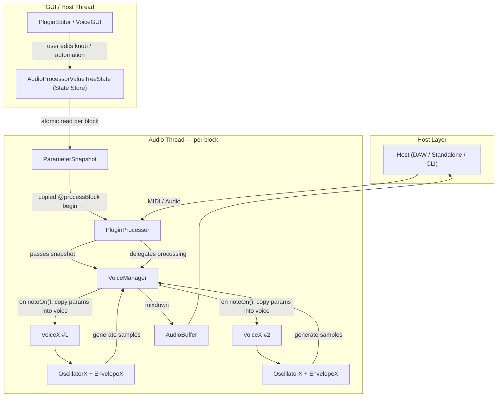
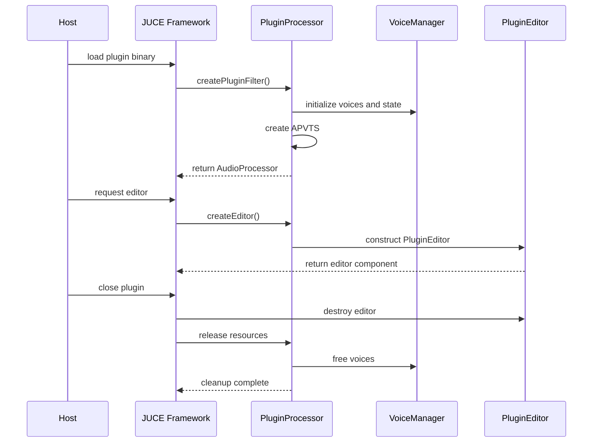
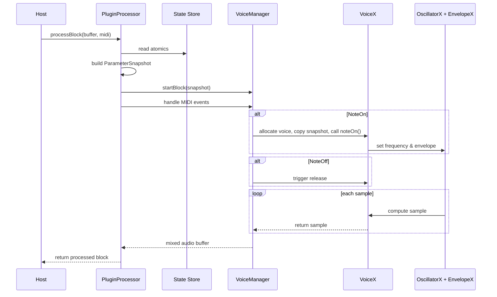
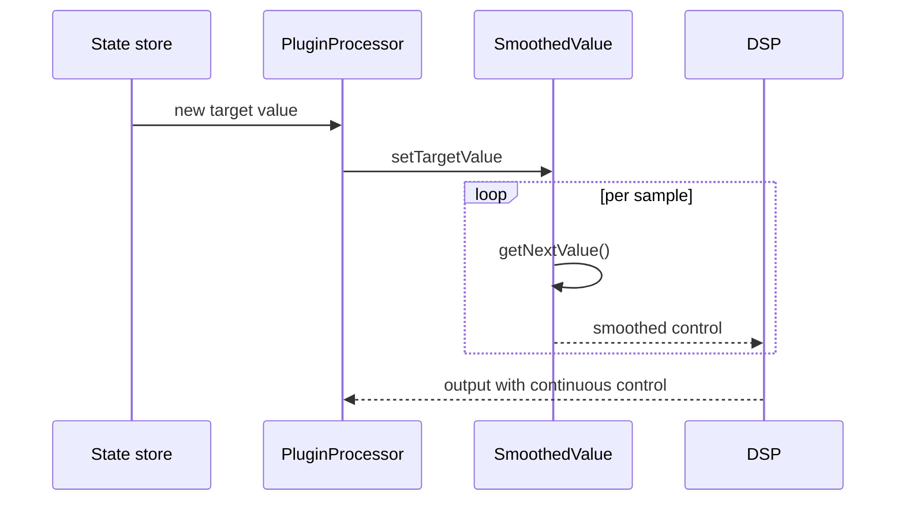
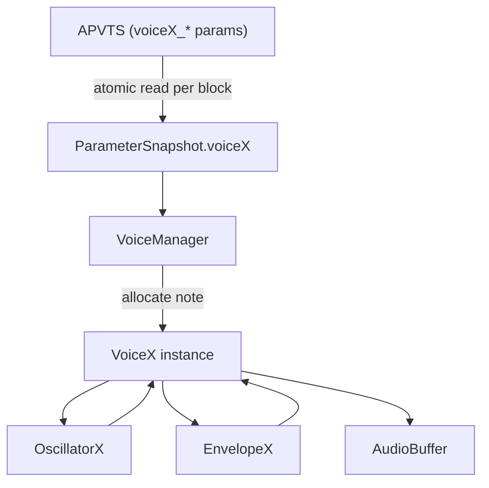
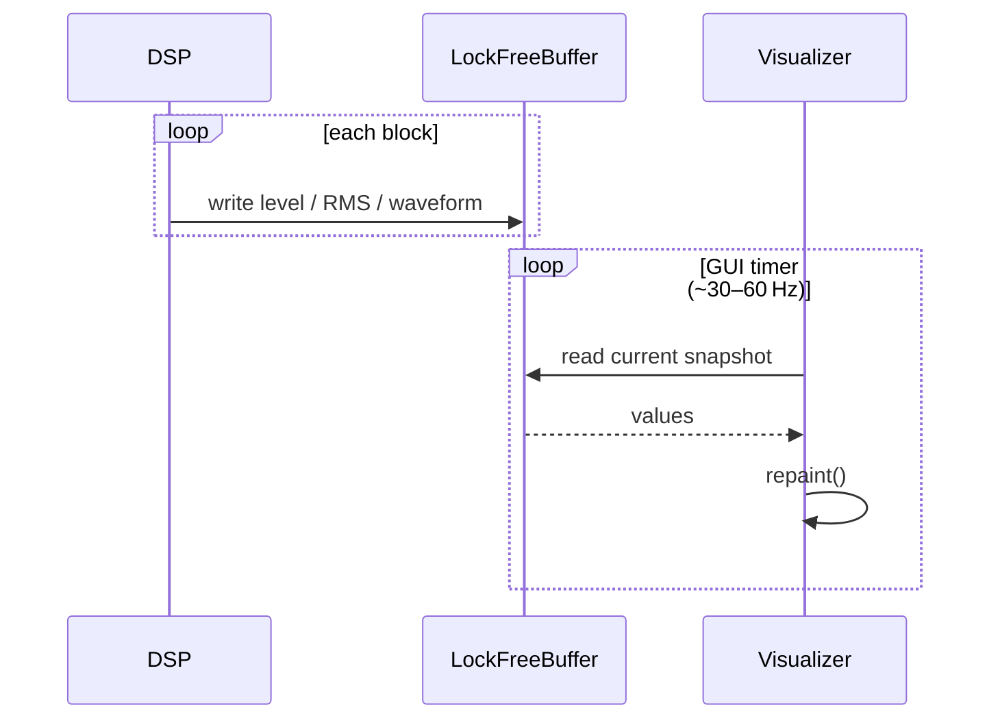

# MIDIControl001 — System Architecture (Engineering Whitepaper)

> **Status:** Canonical version — reflects the unified modular VoiceX architecture (post Phase 5‑D).  
> This replaces earlier internal diagrams and ad‑hoc notes. It serves as the authoritative reference for contributors building new voices (VoiceB, VoiceC, …) or extending the DSP pipeline.

---

## 1. System Overview

### 1.1 Conceptual Layers

---

## 2. Runtime Context

### 2.1 Host Environments

| Environment | Main Loop Owner | JUCE Role | Entry Point |
|--------------|------------------|------------|--------------|
| **DAW (e.g. FL Studio, Logic)** | Host engine | Runs plugin process, manages `AudioProcessor` + GUI | `processBlock()` |
| **JUCE Standalone** | JUCE wrapper | Provides audio/MIDI devices | `StandaloneFilterWindow` |
| **CLI Runner** | Custom `main()` | Manual instantiation and buffer render | `PluginProcessor::processBlock()` |

### 2.2 Initialization Sequence

---

## 3. Core Dataflow

### 3.1 Overview

---

## 4. Parameter Pipeline

| Stage | Source → Target | Frequency | Description |
|--------|------------------|------------|--------------|
| **A. APVTS → Snapshot** | GUI atomics → Audio snapshot | Once per block | Freeze params for real‑time thread |
| **B. Snapshot → VoiceManager** | Stack → manager copy | Once per block | Consistent allocator input |
| **C. VoiceManager → VoiceX** | Snapshot → voice fields | Once per noteOn | Initialize per‑note parameters |
| **D. VoiceX → DSP Modules** | Voice fields → oscillator/envelope | Once per note start | Configure real DSP behavior |

### Time Ownership
| Layer | Time Scale | Data Ownership |
|--------|-------------|----------------|
| GUI / Host | Asynchronous | `APVTS` (shared atomics) |
| AudioProcessor | Block‑granular | `ParameterSnapshot` |
| VoiceManager | Block‑granular | `currentSnapshot_` |
| VoiceX / DSP | Sample‑granular | Local floats |

---

## 5. Parameter Update & Smoothing

### 5.1 Smoothing Model

### 5.2 Notes
- All smoothing is **lock‑free** and **real‑time safe**.  
- The plugin uses *block‑boundary snapshots* and *per‑sample interpolation*.  
- SmoothedValue prevents zipper noise during automation or rapid CC motion.

---

## 6. Voice Architecture (VoiceX)

### 6.1 Voice Lifecycle

### 6.2 Responsibilities

| Component | Role | Notes |
|------------|------|-------|
| **VoiceManager** | Allocates, updates, and mixes active voices | Owns persistent CC state and snapshot pointer |
| **VoiceX** | Represents one active note | Uses snapshot data at noteOn; updates envelopes live |
| **OscillatorX** | Generates base waveform | Can be subclassed (sine, saw, FM, wavetable) |
| **EnvelopeX** | Controls amplitude over time | Supports attack/release and future mod types |
| **PluginProcessor** | Owns APVTS and delegates work | Bridges GUI ↔ DSP safely |

---

## 7. Modularity and Extensibility

### 7.1 Adding New Voice Types

To extend the system:
1. **Subclass `BaseVoice`** → implement `VoiceB`, `VoiceC`, etc.  
2. Implement matching `OscillatorB`, `EnvelopeC`, or new DSP blocks.  
3. Add mappings in `ParamLayout.cpp` (parameter ranges & defaults).  
4. Extend `VoiceManager` allocation logic to include new types if required.  
5. Optionally redefine controller mapping (`handleController`) for each new voice type.

### 7.2 Reusable Contracts

| Interface | Contract | Guarantee |
|------------|-----------|------------|
| `noteOn(snapshot, midiNote, velocity)` | Must start oscillator and envelope using `midiNoteToHz(note)` baseline | Ensures pitch correctness |
| `noteOff()` | Must release and mark inactive | Prevents ghost voices |
| `render(buffer, numSamples)` | Must mix its signal into the provided buffer | Polyphony-safe |
| `updateParams(vp)` | Should apply new parameters only when inactive | Real-time safety |

---

## 8. Control Mapping and MIDI

- **CC normalization**: 0–127 → 0–1 via `ccTo01()` in `PluginProcessor`.  
- **Persistent control state** lives in `VoiceManager` (e.g., envelope times, detune, mod depth).  
- **CCs are not hardcoded**: each `VoiceX` interprets them according to its design.  
- **MIDI NoteOn** always defines base frequency:  
  \\( f = 440 × 2^{(note-69)/12} \\)  
  Detune or modulation are applied multiplicatively (ratio form).

---

## 9. Visualization and Feedback

### 9.1 Metering Loop

---

## 10. Summary

The **MIDIControl001 VoiceX Framework** defines a modular real‑time synth pipeline:
- **PluginProcessor** orchestrates block‑level scheduling and CC routing.  
- **VoiceManager** maintains polyphony, parameter snapshots, and global gain.  
- **VoiceX / OscillatorX / EnvelopeX** define per‑voice DSP behavior.  
- **APVTS** guarantees thread‑safe parameter coherence between GUI and DSP.  
- The architecture scales to new timbres, new control mappings, and arbitrary host environments.

---

> **Maintainers:** All modifications to core DSP or VoiceX contracts should be documented in `docs/architecture.md` before merging to `main`.
