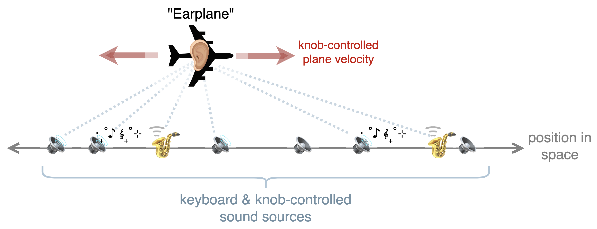
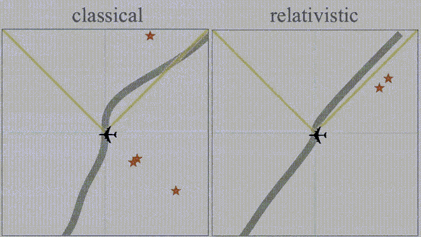

# VOICE TYPES ROADMAP

The triple **`VoiceA` / `OscillatorA` / `EnvelopeA`** constitutes the baseline modular voice type for this plugin **MIDIControl001**. Architectural details can be found in [docs/architecture.md](../docs/architecture.md). The present document outlines the direction for more advanced **`Voice` / `Oscillator` / `Envelope`** combinations—voice architectures designed to explore richer physical and psychoacoustic behaviors while maintaining the same pluggable infrastructure.

---

## 1. `VoiceDopp`: Classical Doppler, Moving Through Fields of Emitters

### 1.1 Conceptual Overview

The `VoiceDopp` type models a *field of micro sources*, that is, hundreds of discrete oscillators positioned in 3-dimensional space, each representing a small emitter of sound. The listener moves through this field, and `VoiceDopp` simulates what this listener hears. As the sounds reach the moving listener's ear, the listener perceives the cumulative Doppler shifts and intensity falloff of the sound coming from these emitters. MIDI controller knobs change the listener's direction and velocity, and MIDI controller keys trigger various emitters in the field.

<figure align="center">
  
  <figcaption><b>Figure 1.</b> Concept sketch of the VoiceDopp modular voice architecture.</figcaption>
</figure>

This simulates the physics of *motion through a dynamic soundscape*: as the listener changes velocity and direction, the perceived pitch and amplitude of each emitter are continuously modulated according to classical Doppler and distance laws.

---
### 1.2 Implmentation
#### 1.2.1 Physical Basis / Underlying Mathematics

Each emitter, indexed with subscript $i$, has position $x_{i}(t)$ and velocity $v_{i}(t)$. The listener has position $x_{L}(t)$ and velocity $v_{L}(t)$. If $f_{i}(t)$ denotes the frequency produced by emitter $i$, the instantaneous perceived frequency $f'_{i}(t)$ coming from emitter $i$, as perceived by the moving listener, is given by the classical [*Doppler relation*](https://en.wikipedia.org/wiki/Doppler_effect):

$$
f'_i(t)=\frac{c + v_L \cdot \hat{r}_i(t)}{c - v_i \cdot \hat{r}_i(t)}f_i(t),
$$where $\hat{r}_i(t) = \frac{x_i(t) - x_L(t)}{\|x_i(t) - x_L(t)\|}$ and $c$ is the speed of sound (≈343 m/s).

Amplitude scales as inverse square of distance:

$$
A_i(t)=A_0\Big/\|x_i(t) - x_L(t)\|^2.
$$

These computations are lightweight enough to run per block, with emitter states updated at audio‑rate interpolation.

---

#### 1.2.2 Parameter Mapping (MIDI / CC)

Each MIDI key spawns a local field of emitters with unique base frequencies. The global listener velocity (CC6) applies across all active notes, so pitch shifts are *coherent across the soundscape*.

<figure align="center">
  
  <figcaption><b>Figure 2.</b> Akai MPK Mini MIDI controller with knob labels.</figcaption>
</figure>

| CC# | Control | Range / Meaning | DSP Effect |
|----|----------|----------------|-------------|
| CC1–CC5 | *Global volume, global mix, voice attack, voice release, & voice pitch* | Retained from baseline synth | Affects overall mixdown and dry/wet blend, as well as ADSR envelope and keyboard tuning |
| CC6 | *Signed velocity of listener* | 0.0 → $+-v^{\text{max}}$ (reverse), 0.5 → 0 (stationary), 1.0 → $+v^{\text{max}}$ (forward) | Determines relative Doppler shift of all emitters |
| CC7 | *Emitter field density* | 0.0 → sparse (few emitters), 1.0 → dense (hundreds) | Controls number of emitters per note and their spatial distribution |

---

#### 1.2.3 Implementation Sketch

- `VoiceDopp` inherits from `BaseVoice` and overrides `render()` to manage a small emitter pool.  
- Each emitter is an instance of a lightweight `DoppEmitter` struct holding phase, base frequency, position, and velocity.  
- `OscillatorDopp` computes per‑emitter waveforms (sine or band‑limited) with frequency offsets from Doppler equations.  
- `EnvelopeDopp` modulates the overall amplitude envelope for the note cluster (attack/decay).  
- The `VoiceManager` provides `CC6` and `CC7` via `ParameterSnapshot` so that all active voices receive updated motion and density parameters per block.  
- All emitters mix to a mono or stereo buffer with simple distance‑based panning.

```cpp
struct DoppEmitter {
    juce::Vector3D<float> pos, vel;
    float baseFreq, phase;
};

void VoiceDopp::render(float* buffer, int numSamples) {
    for (auto& e : emitters_) {
        float dopplerHz = e.baseFreq * (c + vL.dot(rhat(e))) / (c - e.vel.dot(rhat(e)));
        oscDopp_.setFrequency(dopplerHz);
        for (int n = 0; n < numSamples; ++n)
            buffer[n] += envDopp_.nextSample() * oscDopp_.nextSample();
    }
}
```

---

### 1.5 Integration with Modular Architecture

| Component | Role | Connection |
|------------|------|------------|
| `PluginProcessor` | reads CC6/CC7 from APVTS | builds `ParameterSnapshot` |
| `VoiceManager` | distributes snapshot per block | updates all `VoiceDopp` instances |
| `VoiceDopp` | per‑note engine | spawns & updates emitters |
| `OscillatorDopp` | per‑emitter generator | applies Doppler shift |
| `EnvelopeDopp` | per‑voice amplitude shaping | matches perceptual dynamics |

This architecture remains fully compatible with the existing **VoiceX** model: adding new voice types involves subclassing and parameter‑group registration, with no changes to `PluginProcessor` or `VoiceManager` fundamentals.

---

## 2 `VoiceLET` / `OscillatorLET` / `EnvelopeLET`

[...]

### 2.1 Underlying concept

[...]

<figure align="center">
  
  <figcaption><b>Figure 3.</b> Concept sketch of the VoiceLET modular voice architecture.</figcaption>
</figure>

### 1.2 Implmentation sketch

[...]

- Finalize CC routing matrix
- Add VoiceB module with dual-envelope mode

## 3 `VoiceEns` / `FreqBandEns` / `EnvelopeEns`

[...]

a
- Introduce ModMatrix UI
- Implement parameter morphing API
