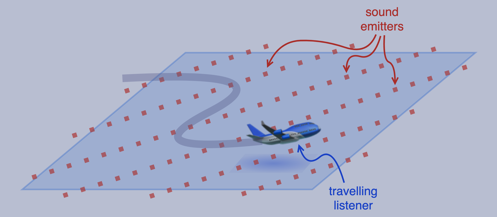
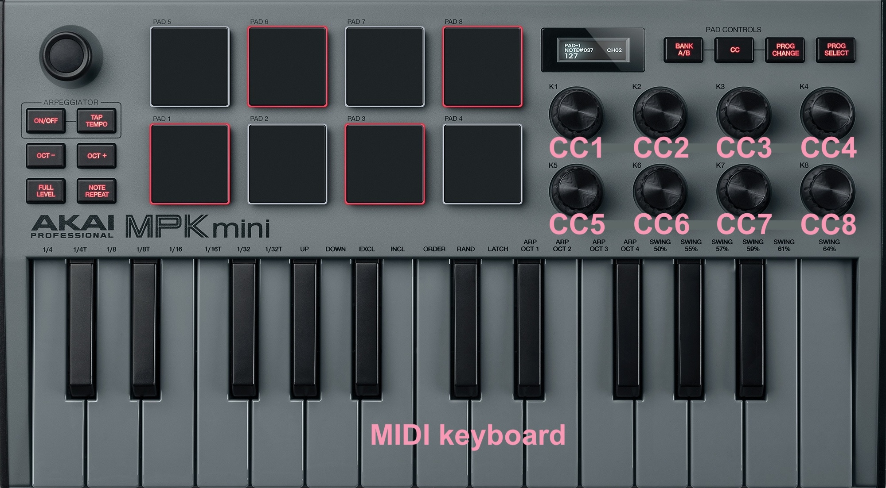
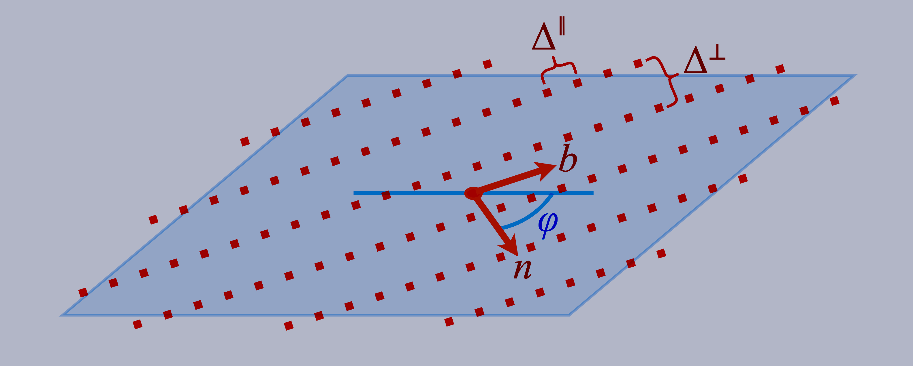

# VoiceDopp Mathematical Specification (Retarded-Time, Predictive Selection)

**Project:** MIDIControl001  
**Module:** `VoiceDopp` (classical Doppler, stationary emitters, moving listener)  
**Scope:** Formal mathematical model suitable for re‑implementation.

---

## 0. Global Symbols and Units

  
  
<b>Figure 1.</b> Pysical system underlying VoiceDopp /OscillatorDopp / EnvelopeDopp.

**Ambient space:**
- *Ambient space*: $\bold{R}^2$ (planar model; can be extended to $\bold{R}^3$).  
- *Speed of sound in atmosphere*: $c>0$ (m/s).  
- *Absorption coefficient in atmosphere*: $\alpha \ge 0$ (1/m).

**Travelling listener:**
- *Listener trajectory*: continuously differentiable function
$$
x_L : \bold{R}_{\ge 0} \longrightarrow \bold{R}^2
$$
- Listener velocity: $v_L(t):=\frac{d}{dt}x_L(t)$.

**Emitter field:**
- *Note-on/off times for a given voice*:
$$
t_{\text{on}}\;<\;t_{\text{off}}\;\;\in\;\bold{R}_{\ge 0}\quad\text{( with $t_{\text{off}}=\infty$ if key held )}
$$
- *Base frequency for* $i^{\textit{th}}$ *emitter*: $\lambda_{i}>0$ (Hz)
- *Base phase for* $i^{\textit{th}}$ *emitter*: $\phi_i\in\bold{R}$.
- *Carrier signal for $i^{\text{th}}$ emiiter*: $s_i(t) := \sin\!\big(2\pi \lambda_{i}\, t + \phi_i\big)$  
- *ADSR envelope function*:
$$
A^{\text{env}} : \bold{R}^2 \longrightarrow [0,1]\quad\text{( defined in §2.2 )}
$$
- *Emitter field pulse rate*: $\mu_{\text{pulse}}>0$ (Hz) (defined in §1.3), 
- *Emitter field pulsating amplitude*:
$$
A^{\text{field}}(t)\;=\;\frac{1}{2}\big(\,1+\sin(\,2\pi\cdot\mu_{\text{pulse}}\cdot t)\,\big)
$$  
- *Emitter sound attenuation kernel*: choosing a small *regularizer* $r_{\min}>0$ (e.g. $10^{-3}$), we get an *attentuation kernel*
$$
w(r)=\dfrac{e^{-\alpha r}}{\;\max(r,r_{\min})\;}
$$

---

## 1. Control Mapping (MIDI CC → Parameters)

  
  
<b>Figure 1.</b> Akai MPK Mini MIDI controller with knob labels.

For MIDI controller knob index $k$, we interpet the running value, describing the position of the knob, the *(normalized) value stream* assocaited to that knob, as a continuous function
$$
\textsf{CC}_{k}:\bold{R}_{\ge0}\longrightarrow [0,1]
$$
So for instance, $\textsf{CC}_{5}(t)$ dentoes the value stream coming from MIDI controller knob `CC5`.

### 1.1 Global, time‑varying controls (sampled every audio block)

**Travelling listener knobs:**
- *Listener speed control* (`CC5`): $s(t):=\textsf{CC}_{5}(t)\in[0,1]$.
- *Maximum listener speed*: $v_{\max}\,\in\,\bold{R}_{>0}$.
- *Scalar listener speed*: $v(t):=v_{\max}\cdot s(t)$.
- *Heading control* (`CC6`):
  $$
  \theta(t)\;:=\;2\pi\cdot\textsf{CC}_{6}(t)-\pi,
  $$
  which takes values in $[-\pi,\pi)$.
- *Unit heading vector*: $u(\theta):=(\,\cos\theta,\;\sin\theta\,)$.

**Listener kinematics from the Fundamental theorem of Calculus.** Choose a reference time $t_0$ and origin
$$
x_0\;:=\;x(t_0)
$$
Then we can recover listener position from the scalar listener speed $v(t)$ and the unit heading vector $u(\theta)$ via the integral
$$
x_L(t)\;=\;x_0+\int_{t_0}^t v(\tau)\cdot u\big(\theta(\tau)\big)\;\text{d}\tau
$$
*(Piecewise‑constant blockwise integration is permitted in implementation.)*

**Emitter field knobs:**

  
  
<b>Figure 2.</b> Concept sketch of the VoiceDopp modular voice architecture.

- *MIDI kniob value at note-on*: $\textsf{CC}_{k}^{(\text{on})}:=\textsf{CC}_{k}(t_{\text{on}})$.
- *Emitter lattice orientation* (`CC7`):
$$
\begin{array}{rl}
\textit{orientation angle}: &
\varphi\;:=\;2\pi\cdot\textsf{CC}_{7}^{(\text{on})}-\pi \\
\textit{associated normal}: &
n(\varphi):=\left(\!\!\begin{array}{c}\cos\varphi\\ \sin\varphi\end{array}\!\!\right) \\
\textit{associated tangent}: &
b(\varphi):=\left(\!\!\begin{array}{c}-\sin\varphi\\ \cos\varphi\end{array}\!\!\right)
\end{array}
$$
- *Emitter line density* (`CC8`): $\rho:=\textsf{CC}_{8}^{(\text{on})}\in[0,1]$
- *Emitter line spacing*:
  $$
  \Delta^\perp
  \;:=\;
  \begin{cases}
  +\infty, & \rho=0 \quad(\text{single line}),\\[3pt]
  1/\rho, & \rho\in(0,1] \quad(\text{lines every }1/\rho).
  \end{cases}
  $$
- *Along‑line emitter spacing*: fixed $\Delta^\parallel=1$ (unit lattice) unless otherwise stated.
- *Field pulse frequency* (`CC4`): with bounds $0<\mu_{\min}<\mu_{\max}$, let
  $$
  \mu_{\text{pulse}}\;:=\;\mu_{\min} + \big(\,\mu_{\max}-\mu_{\min}\,\big)\cdot\textsf{CC}_{4}^{(\text{on})}
  $$
  Typical: $\mu_{\min}=0.1\,\text{Hz}$, $\mu_{\max}=8\,\text{Hz}$.
- *Baseline synthesis params* (`CC1`-`CC3`): retain volume/mix/ADSR parameters as in `VoiceA` (omitted here).

---

## 1.3 Emitter Set (Lattice of Lines)

For a given note, the emitter set $\mathcal{E}\subset\bold{R}^2$ is the union of parallel lines with normal $n(\varphi)$ spaced by $\Delta^\perp$, each line populated by points at spacing $\Delta^\parallel$ along tangent $b(\varphi)$.

Formally, index lines by $k\in\bold{Z}$ and along‑line positions by $m\in\bold{Z}$. The emitter coordinates are
$$
x_{k,m}(\rho,\,\varphi)\;\;:=\;\;k\cdot\Delta^\perp\cdot n(\varphi)\;\;+\;\; m\cdot\Delta^\parallel\cdot b(\varphi)
$$
- If $\rho=0$, the set reduces to the single line $k=0$.  
- Otherwise it is an infinite 2‑D lattice embedded as a union of lines.

Because the position of each emitter is uniquely determined by the pair of integers $(k,m)\in\bold{Z}\times\bold{Z}$, we can reinterpret that emitter's index $i$ as being this pair $(k,m)$, so that
$$
x_i\;=\;x_{k,m}(\varrho,\,\varphi).
$$

---

## 2. Source Signal and Retarded Time

The emitter $x_i=x_{k,m}$ carries  frequency $\lambda_{i}=\lambda_{k,m}$. These frequencies might all be equal to the MIDI note frequency, or might be assigned by a deterministic mapping $f(k,m)$. The phase $\phi_i=\phi_{k,m}$ of the $i^{\text{th}}$ emitter may be sampled IID on the interval $[0,2\pi)$, or might be set by design.

### 2.1 Retarded time for stationary emitters

For emitter $i$ at fixed position $x_i$ and listener at time-varying position $x_L(t)$, the distance between the listener and the emitter at time $t$ is given by
$$
r_i(t)\;:=\;\|x_i - x_L(t)\|
$$
The emitter's *retarded* time, as experienced by the listener, is
$$
t^{\text{ret}}_{i}\;:=\;t - \frac{\;r_i(t)\;}{c}
$$

### 2.2 ADSR envelope (source‑side, evaluated at emission)
An *attack/decay/sustain/release curve* (*ADSR curve*) is a notnecessarily continuous function 
$$
A^{\text{env}}_{i}:\bold{R}\longrightarrow[0,1],
$$
supported a time interval $[t_{\text{on}},\,t_{\text{off}}]$, that describes the amplitude envelope of the signal produced by a single emitter. The specific shape of the ADSR curve is determined by auxiliary parameters, and has piecewise form
$$
A^{\text{env}}_{i}(t) =
\begin{cases}
0, & t<t_{\text{on}},\\[3pt]
\text{attack/decay/sustain at }(t-t_{\text{on}}), & t_{\text{on}}\le t<t_{\text{off}},\\[3pt]
\text{release at }(t-t_{\text{off}}), & t\ge t_{\text{off}}.
\end{cases}
$$
For each emitter, the *ADSR envelope factor at listener time* $t$ is $A^{\text{env}}_{i}(t^{\text{ret}}_i)$. The *field pulse envelope at listener time* is $A^{\text{field}}(t^{\text{ret}}_{i})$. The *carrier signal at listener time* is $s_i(t^{\text{ret}}_{i})$. 

*All of these, ADSR envelope factor at listener time, field pulse envelope at listener time, and carrier signal at listener time, are evaluated **at emission time**.* [THIS CAN'T BE CORRECT]

Thus the *er‑emitter received signal* is
$$
p_i(t) \;=\; w\big(r_i(t)\big)\;\cdot\;A^{\text{env}}_{i}(t^{\text{ret}}_{i})\;\cdot\;A^{\text{field}}_{i}(t^{\text{ret}}_{i})\;\cdot\; s_{i}(t^{\text{ret}}_{i}).
$$

**Remark (Doppler correctness).** Differentiation yields
$$
\frac{\text{d}t^{\text{ret}}_{i}}{\text{d}t} = 1 - \frac{\dot r_i(t)}{c}
= 1 - \frac{v_L(t)\cdot \hat r_i(t)}{c},\quad \hat r_i(t)=\frac{x_i-x_L(t)}{r_i(t)},
$$
so the instantaneous heard frequency equals
$$
\lambda_{i}^{\text{heard}}(t) = \frac{\text{d}}{\text{d}t}\Big(\frac{1}{2\pi}\arg s_i^{\star}(t)\Big)
= \frac{\lambda_{i}}{1 - \tfrac{v_L(t)\cdot \hat r_i(t)}{c}},
$$
i.e. classical Doppler for moving receiver / stationary source.

---

## 3. Finite Active Set via Predictive Selection

The emitter set $\mathcal{E}$ is infinite (except when $\rho=0$). At any listener time $t$ we select a **finite active subset** $\mathcal{E}_{\text{act}}(t)\subset \mathcal{E}$ of fixed cardinality $K$ using a predictive score with hysteresis.

### 3.1 Eligibility region with hysteresis

Choose radii $0<R_{\text{in}}<R_{\text{out}}$ and define eligibility
$$
\mathcal{E}_{\text{elig}}(t)=\{\,i\in\mathcal{E}\,:\, r_i(t)\le R_{\text{out}}\,\}.
$$
Members of $\mathcal{E}_{\text{act}}(t)$ are retained while $r_i(t)\le R_{\text{out}}$ and become re‑eligible only when $r_i(t)\le R_{\text{in}}$.

### 3.2 Predictive score

Fix a look‑ahead horizon $H>0$ and a set $\mathcal{T}=\{0,\tfrac{H}{2},H\}$. Approximate listener motion as $x_L(t+\tau)\approx x_L(t)+v_L(t)\,\tau$. For each $i$ and $\tau\in\mathcal{T}$, define
$$
\tilde r_{i,\tau}\;=\;\big\|x_i - \big(x_L(t)+v_L(t)\tau\big)\big\|,\qquad
\tilde t^{\text{ret}}_{i,\tau}\;=\;(t+\tau)-\tilde r_{i,\tau}/c
$$
The associated score is then
$$
\text{score}_{i,\tau}= w(\tilde r_{i,\tau})\cdot A^{\text{env}}_{i}(\tilde t^{\text{ret}}_{i,\tau})\cdot A^{\text{field}}(\tilde t^{\text{ret}}_{i,\tau})
$$
The **predictive score** is
$$
\text{score}_{i}(t)=\max \big\{\text{score}_{i,0}(t),\;\text{score}_{i,\frac{H}{2}}(t),\;\text{score}_{i,H}(t)\big\}
$$

### 3.3 Top‑$K$ with soft margin and crossfades

Let $K\in\bold{N}$ and *margin* $\delta\ge 0$. At time $t$, among $\mathcal{E}_{\text{elig}}(t)$, choose $\mathcal{E}_{\text{act}}(t)$ as the size‑$K$ set with largest $\text{score}_{i}(t)$, preferring incumbents unless a challenger exceeds the $K$-th score by $\delta$. When membership changes, each emitter $i$ carries a *mix gain* $g_i(t)\in[0,1]$ satisfying
$$
\dot g_i(t)=
\begin{cases}
+1/T_{\text{xfade}}, & i \text{ enters (ramp up)},\\
-1/T_{\text{xfade}}, & i \text{ exits (ramp down)},\\
0, & \text{otherwise},
\end{cases}
\qquad g_i \text{ clamped to }[0,1].
$$

The **rendered pressure** is then
$$
p(t)=\sum_{i\in\mathcal{E}_{\text{act}}(t)} g_i(t)\,p_i(t).
$$

---

## 4. Convergence and Stability Notes

1. **Analytic convergence.** For $\alpha>0$, $\sum_{i\in\mathcal{E}} w(r_i(t))$ is absolutely summable uniformly on compact time intervals. For $\alpha=0$, the $1/r$ tail over an infinite 2‑D lattice diverges; hence we require either $\alpha>0$ or the finite selection $\mathcal{E}_{\text{act}}(t)$ above.

2. **Time variation.** Since $v_L \ll c$, $r_i(t)$ and $t^{\text{ret}}_{i}$ vary slowly; evaluating selection scores on a coarse grid $\mathcal{T}$ is sufficient for stable membership.

3. **Causality.** All envelopes and pulses are evaluated at emission time $t^{\text{ret}}_{i}$, ensuring physically correct delays and Doppler warping without explicit delay lines.

---

*End of specification.*
