# Plugin Design / Architecture

## ?

### Runtime Context — Host Environments

JUCE plugins always run *inside a host*, which owns the real-time audio loop and the message (GUI) thread.  
Depending on how the plugin is built or launched, the *host* can be:

1. a **DAW** such as FL Studio or Logic (VST3/AU),
2. the **JUCE Standalone wrapper** (self-hosted executable),
3. a **custom CLI runner** that instantiates the DSP directly.

All three call the same `PluginProcessor` and optional `PluginEditor`,  
but differ in *who owns the main loop* and *who calls `processBlock()`*.

#### Host responsibilities

| Environment | Who owns main loop | What JUCE does | Typical entry point |
|--------------|--------------------|----------------|---------------------|
| **DAW Host (e.g. FL Studio)** | The DAW’s engine | JUCE runs *inside* the plugin process, handling `AudioProcessor` + GUI layers | `processBlock()` called by host |
| **JUCE Standalone** | JUCE itself | JUCE provides audio + MIDI devices and runs its own threads | `StandaloneFilterWindow` |
| **CLI Runner (Custom)** | Your `main()` | You instantiate `PluginProcessor` manually, feed MIDI/buffers, render to file | `PluginProcessor::processBlock()` |

#### Conceptual layering

```text
       [DAW Host] → calls → [JUCE Plugin Framework] → [PluginProcessor → DSP]
[Standalone Host] → calls → [JUCE Plugin Framework] → [PluginProcessor → DSP]
     [CLI Runner] → calls → [JUCE Plugin Framework] → [PluginProcessor → DSP]
```

### Module Dependencies

```text
Host (DAW / Standalone / CLI)
 ├─ calls → PluginProcessor.cpp  ← (real-time audio loop)
 │             ├─ owns AudioProcessorValueTreeState (APVTS — global State Tree)
 │             ├─ uses VoiceManager.h        (Factory / Pool)
 │             │     ├─ injects per-voice parameter views from APVTS
 │             │     └─ creates modular Voice subclasses (e.g. VoiceA, VoiceB, VoiceC)
 │             │           ├─ uses Oscillator*.h (Concrete Strategies)
 │             │           └─ uses Envelope*.h   (Concrete Strategies)
 │             ├─ uses SmoothedValue (Decorator for per-parameter smoothing)
 │             ├─ updates APVTS from MIDI CC, Host automation, and GUI events
 │             └─ exposes state changes to PluginEditor.cpp and VoiceGUI modules (Observers)
 │
 └─ calls → PluginEditor.cpp  ← (GUI thread / Active Object)
               ├─ observes APVTS via parameter attachments (Observer)
               ├─ spawns per-Voice GUI panels bound to APVTS subtrees
               ├─ reflects current parameter values in GUI controls (knobs, sliders, meters)
               └─ sends user interactions → APVTS (State Tree) → PluginProcessor (two-way binding)
```

## Sound generation


### `Note On` event: *When key is pressed on MIDI controller*

#### A1: `Note On` — External Interface
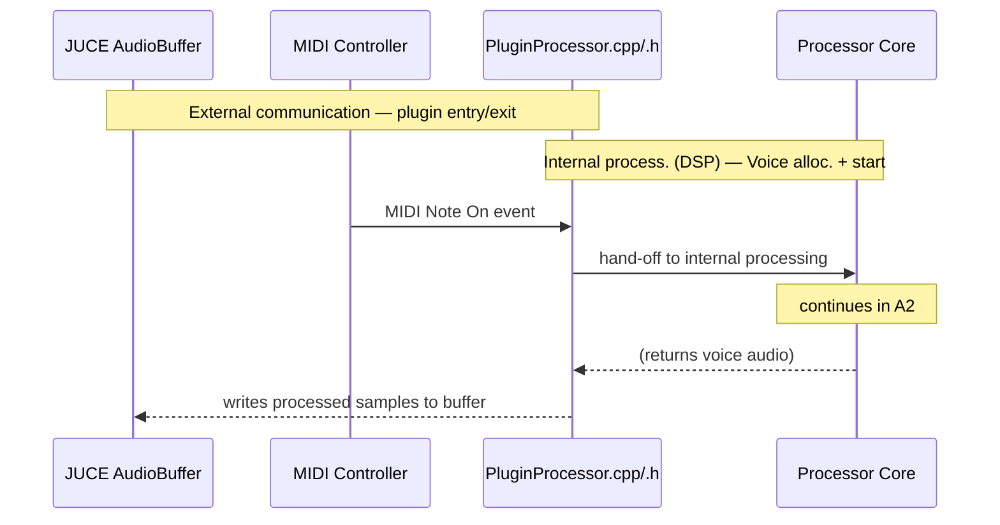

Continues in: [A2: `Note On` — Internal Processing (DSP)](#a2-note-on--internal-processing-dsp)

#### A2: `Note On` — Internal Processing (DSP)
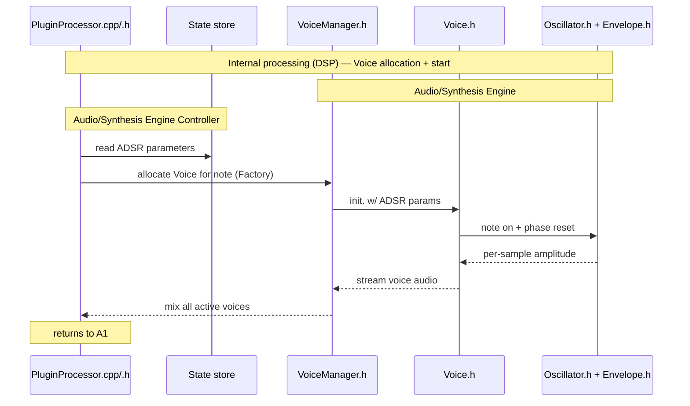

Returns to: [A1: `Note On` — External Interface](#a1-note-on--external-interface)

### `Note Off` event: *When key is lifted up on MIDI controller*

#### B1: `Note Off` — External Interface
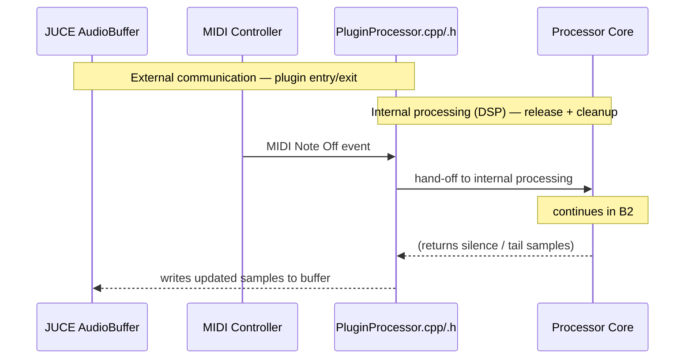

Continues in: [B2: `Note Off` — Internal Processing (DSP)](#b2-note-off--internal-processing-dsp)

#### B2: `Note Off` — Internal Processing (DSP)
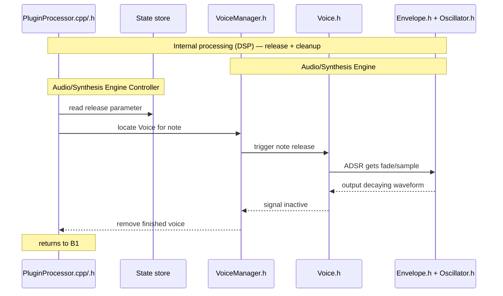

Returns to: [B1: `Note Off` — External Interface](#b1-note-off--external-interface)

## Sound modulation

### `Parameter Update` event: *Triggered by GUI, MIDI CC, or Host Automation*

Parameter updates may originate from:
- user interaction in a **Voice-specific GUI** (e.g. `FMVoiceGUI`, `GranularVoiceGUI`),
- incoming **MIDI controller data**, or
- **DAW automation envelopes**.

All of these sources converge in the **AudioProcessorValueTreeState** (APVTS, *State Store*),  
which the `PluginProcessor` owns. The APVTS synchronizes parameter values  
across threads and provides smoothed transitions for the DSP engine.

Each Voice module and its corresponding GUI read/write parameters through  
a *namespaced parameter group* in the APVTS (e.g. `fm_attack`, `granular_density`).  
This allows multiple voice types and GUIs to coexist modularly without interfering  
with one another.

---

#### C1: Parameter Update — External Interface
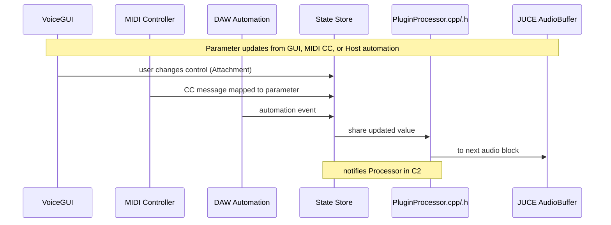

At this point, the Processor has received updated parameter values from the APVTS. See [C2: Parameter Update — Internal Processing](#c2-parameter-update--internal-processing) for how those values are applied within the DSP engine.

#### C2: Parameter Update — Internal Processing
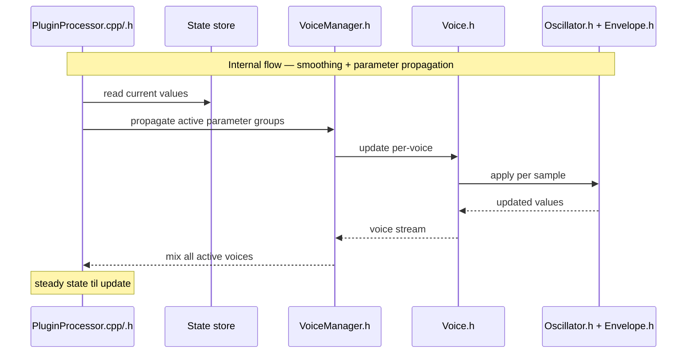

Returns to: [C1: Parameter Update — External Interface](#c1-parameter-update--external-interface)

#### C3: Voice GUI Switching — Dynamic Binding Between GUI and DSP
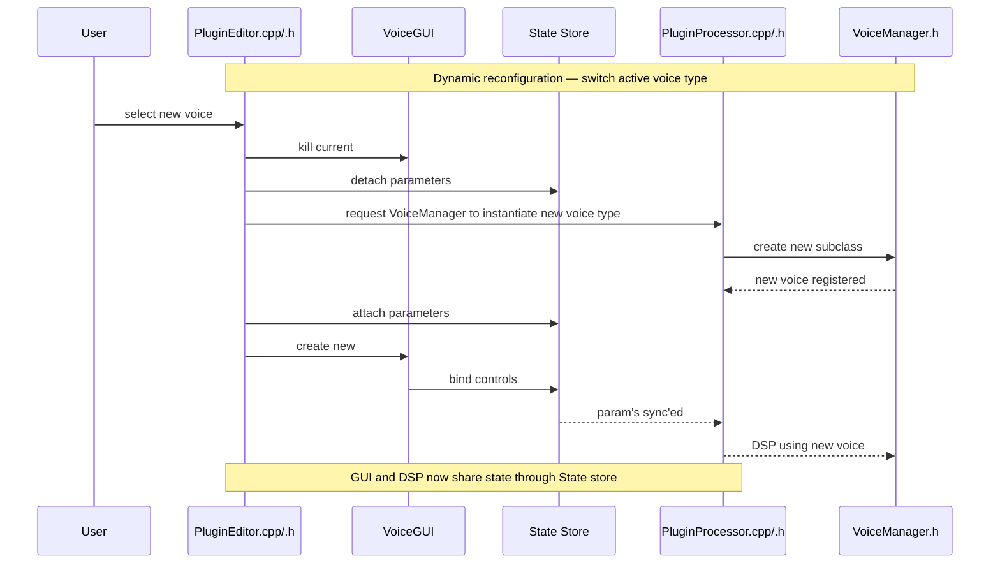

## GUI

##
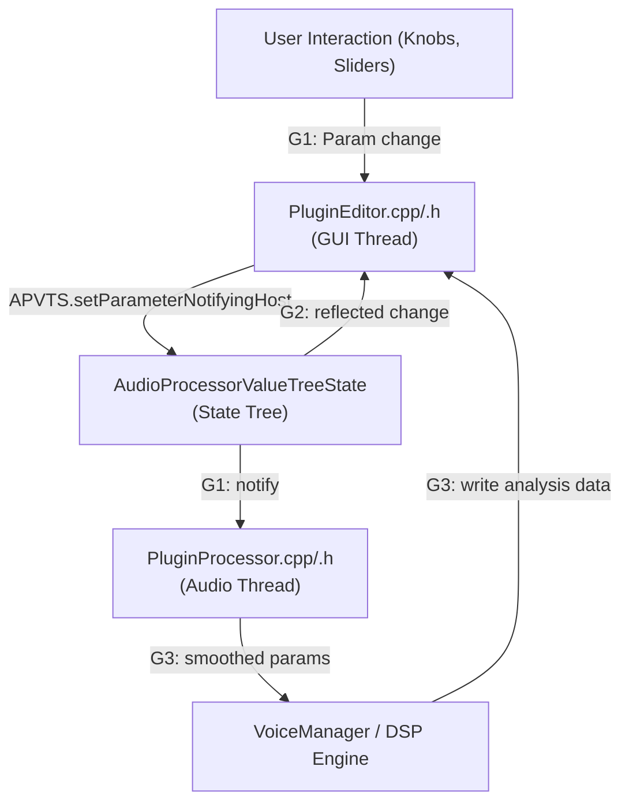

#### G1: Parameter Update (User → Processor)

When the user touches a knob, the GUI sends the change safely to the processor via the AudioProcessorValueTreeState (APVTS), which synchronizes with automation and the real-time thread.

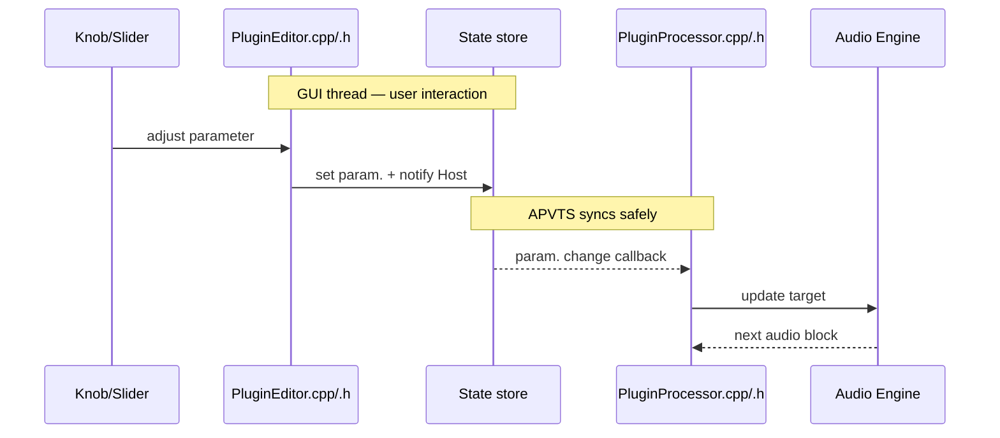

➡ This is the standard control path — it’s what makes knobs automate and record properly in the host.

#### G2: Parameter Reflection (Processor → GUI)

When automation or MIDI CC changes a parameter on the audio thread, the GUI must reflect the new value. JUCE’s APVTS handles this automatically if controls are attached via SliderAttachment, ButtonAttachment, etc.

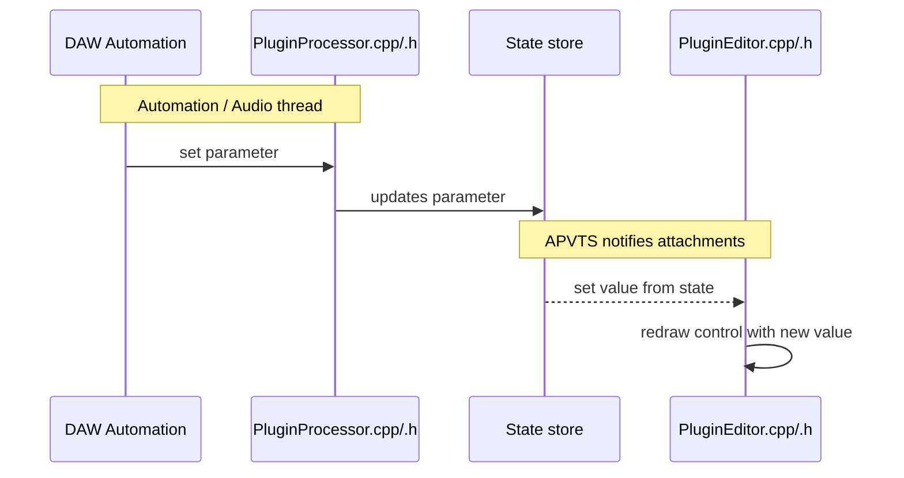

➡ This is the reverse flow — parameters change in the engine, and the GUI follows.

#### G3: Visualization Refresh (DSP → GUI)

This process handles continuous data visualization (waveform preview, envelopes, levels, etc.).
Because the GUI thread can’t directly read DSP memory, this requires a shared lock-free buffer or atomic handoff.

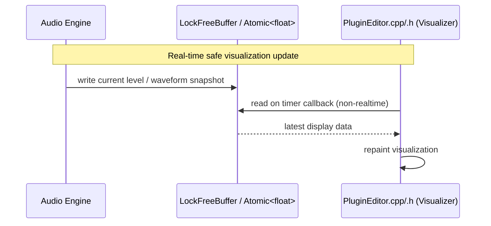

➡ This is custom logic, separate from the APVTS — used for meters, scopes, oscillators, etc.
