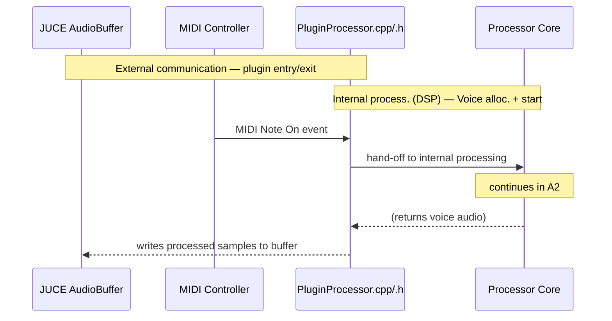
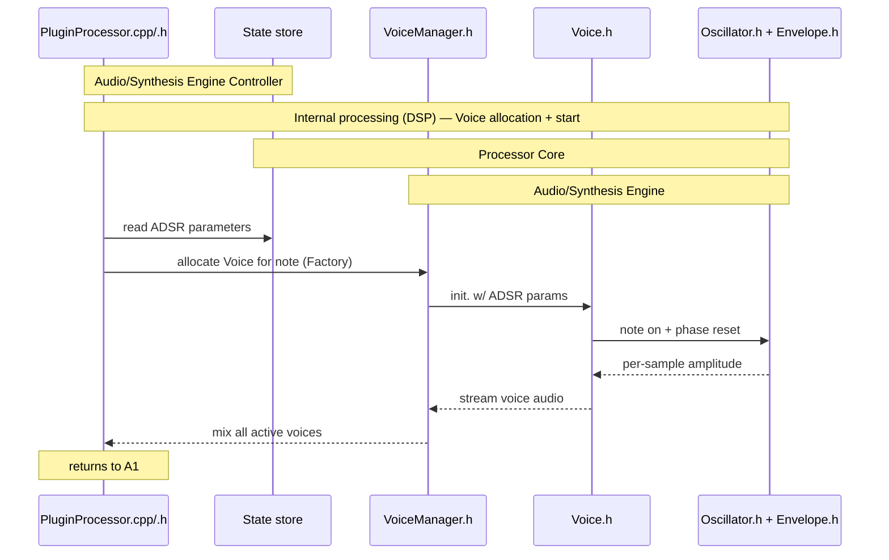
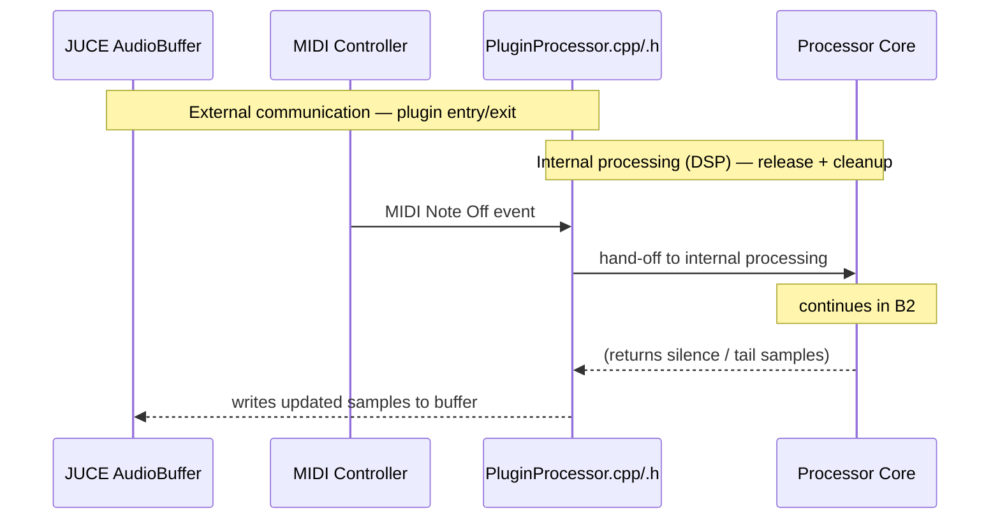
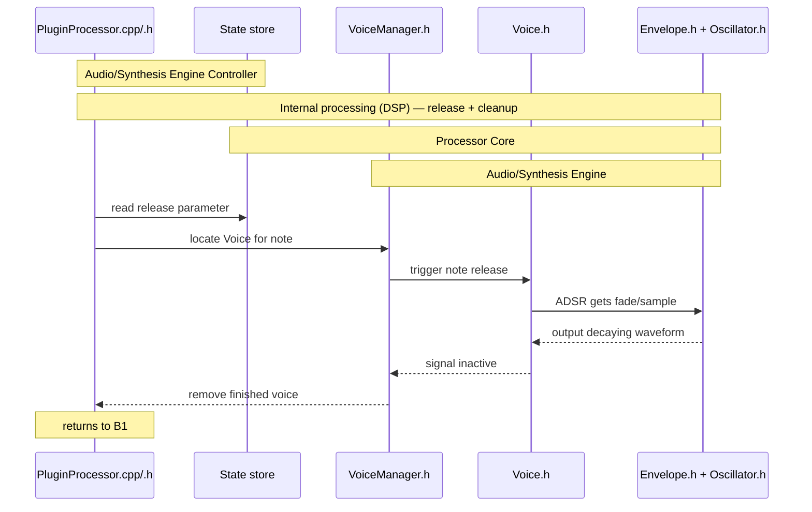
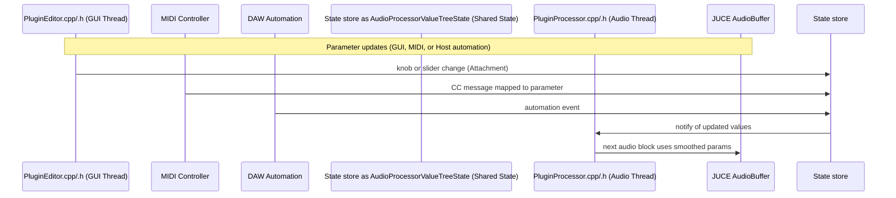
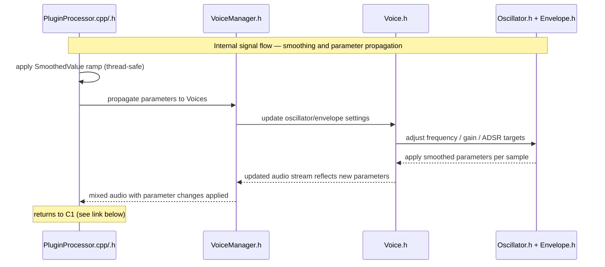

# Plugin Design / Architecture

## Runtime Context — Host Environments

JUCE plugins always run *inside a host*, which owns the real-time audio loop and the message (GUI) thread.  
Depending on how the plugin is built or launched, the *host* can be:

1. a **DAW** such as FL Studio or Logic (VST3/AU),
2. the **JUCE Standalone wrapper** (self-hosted executable),
3. a **custom CLI runner** that instantiates the DSP directly.

All three call the same `PluginProcessor` and optional `PluginEditor`,  
but differ in *who owns the main loop* and *who calls `processBlock()`*.

### Host responsibilities

| Environment | Who owns main loop | What JUCE does | Typical entry point |
|--------------|--------------------|----------------|---------------------|
| **DAW Host (e.g. FL Studio)** | The DAW’s engine | JUCE runs *inside* the plugin process, handling `AudioProcessor` + GUI layers | `processBlock()` called by host |
| **JUCE Standalone** | JUCE itself | JUCE provides audio + MIDI devices and runs its own threads | `StandaloneFilterWindow` |
| **CLI Runner (Custom)** | Your `main()` | You instantiate `PluginProcessor` manually, feed MIDI/buffers, render to file | `PluginProcessor::processBlock()` |

### Conceptual layering

```text
       [DAW Host] → calls → [JUCE Plugin Framework] → [PluginProcessor → DSP]
[Standalone Host] → calls → [JUCE Plugin Framework] → [PluginProcessor → DSP]
     [CLI Runner] → calls → [JUCE Plugin Framework] → [PluginProcessor → DSP]
```

## Module Dependencies

```text
Host (DAW/Standalone)
 ├─ calls → PluginProcessor.cpp  ← (real-time audio loop)
 │             ├─ owns AudioProcessorValueTreeState (shared parameter state)
 │             ├─ uses VoiceManager.h        (Factory / Pool)
 │             │     └─ uses Voice.h         (Strategy interface)
 │             │           ├─ uses Oscillator.h (Concrete Strategy)
 │             │           └─ uses Envelope.h   (Concrete Strategy)
 │             ├─ uses SmoothedValue (Decorator for per-param smoothing)
 │             ├─ updates ValueTree from MIDI CC / Host automation
 │             └─ notifies PluginEditor.cpp via State store attachments (Observer)
 │
 └─ calls → PluginEditor.cpp     ← (GUI thread / Active Object)
               └─ observes ValueTree via parameter attachments
```

# Sound generation


## `Note On` event: *When key is pressed on MIDI controller*

### A1: `Note On` — External Interface


Continues in: [A2: `Note On` — Internal Processing (DSP)](#a2-note-on--internal-processing-dsp)

### A2: `Note On` — Internal Processing (DSP)


Returns to: [A1: `Note On` — External Interface](#a1-note-on--external-interface)

## `Note Off` event: *When key is lifted up on MIDI controller*

### B1: `Note Off` — External Interface


Continues in: [B2: `Note Off` — Internal Processing (DSP)](#b2-note-off--internal-processing-dsp)

### B2: `Note Off` — Internal Processing (DSP)


Returns to: [B1: `Note Off` — External Interface](#b1-note-off--external-interface)

# Sound modulation

## `Parameter Update` event: *Triggered by GUI, MIDI CC, or Host Automation*

Parameter updates may originate from:
- user interaction in the `PluginEditor`,
- incoming MIDI controller data, or
- DAW automation envelopes.

All of these updates converge in the **AudioProcessorValueTreeState** (State store),  
which the `PluginProcessor` owns. The State store synchronizes parameter values  
across threads and provides smoothed transitions for DSP consumption.

### C1: Parameter Update — External Interface



Continues in: [C2: Parameter Update — Internal Processing](#c2-parameter-update--internal-processing)

### C2: Parameter Update — Internal Processing


Returns to: [C1: Parameter Update — External Interface](#c1-parameter-update--external-interface)