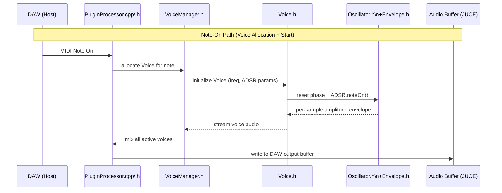
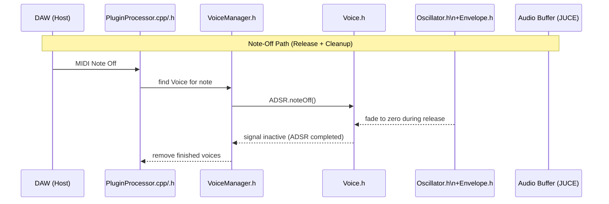
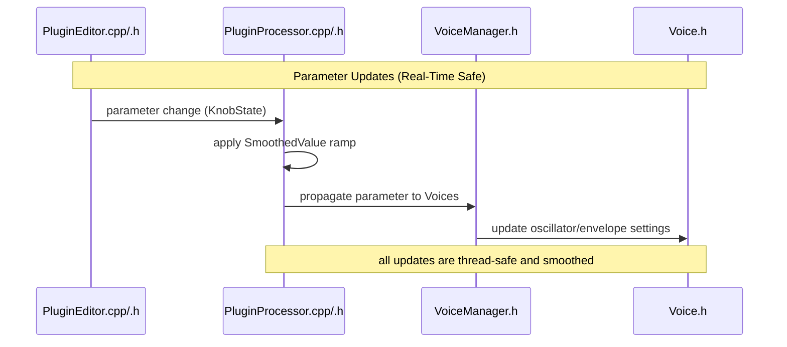

(A) Note-On sequence


(B) Note-Off sequence


(C) Parameter Update


(D) Flowchart View — Signal Path (Top-down)
```mermaid
flowchart TD
DAW["DAW (Host)"]
PluginProcessor["PluginProcessor.cpp/.h"]
VoiceManager["VoiceManager.h"]
Voice["Voice.h"]
DSP["Oscillator.h\n+Envelope.h"]
Output["JUCE Audio Output Buffer"]

DAW -->|MIDI Note On| PluginProcessor -->|allocate Voice| VoiceManager -->|init freq/ADSR| Voice
Voice -->|reset phase + ADSR.noteOn()| DSP -->|per-sample envelope| Voice
Voice -->|audio samples| VoiceManager -->|mix| PluginProcessor -->|write buffer| Output
```