# Plugin Design / Architecture

See the full overview in [README.md](../README.md).

## Overview

### System Overview (High-Level)

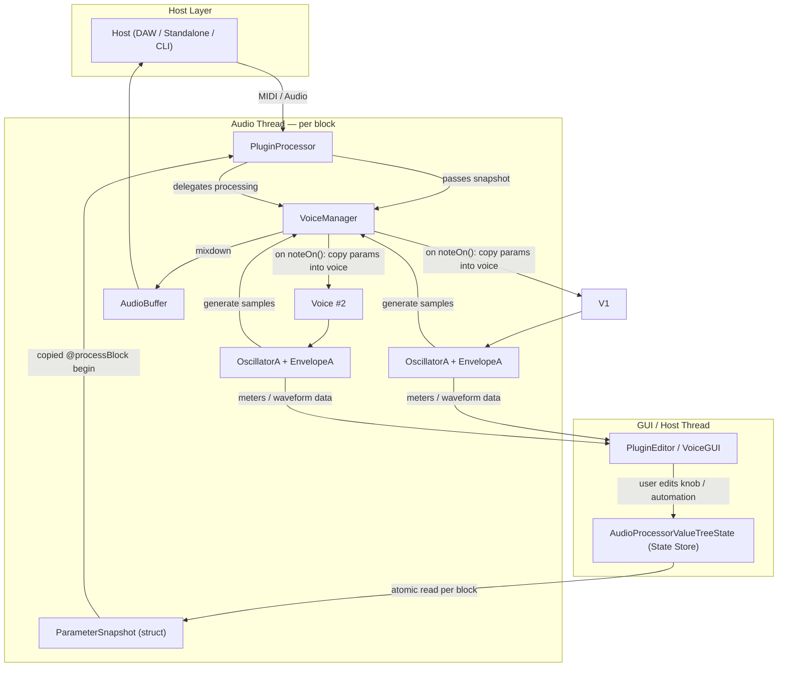
```mermaid
graph TD
    subgraph Host_Layer["Host Layer"]
        HOST["Host (DAW / Standalone / CLI)"]
    end

    subgraph GUI_Thread["GUI / Host Thread"]
        GUI["PluginEditor / VoiceGUI"]
        APVTS["AudioProcessorValueTreeState (State Store)"]
    end

    subgraph Audio_Thread["Audio Thread — per block"]
        PROC["PluginProcessor"]
        SNAP["ParameterSnapshot (struct)"]
        VM["VoiceManager"]
        V2["Voice #2"]
        DSP1["OscillatorA + EnvelopeA"]
        DSP2["OscillatorA + EnvelopeA"]
        BUFFER["AudioBuffer<float>"]
    end

    %% Control flow
    GUI -- "user edits knob / automation" --> APVTS
    APVTS -- "atomic<float> read per block" --> SNAP
    SNAP -- "copied @processBlock begin" --> PROC
    PROC -- "passes snapshot" --> VM
    VM -- "on noteOn(): copy params into voice" --> V1
    VM -- "on noteOn(): copy params into voice" --> V2
    V1 --> DSP1
    V2 --> DSP2

    %% Audio flow
    HOST -- "MIDI / Audio" --> PROC
    PROC -- "delegates processing" --> VM
    DSP1 -- "generate samples" --> VM
    DSP2 -- "generate samples" --> VM
    VM -->|mixdown| BUFFER
    BUFFER --> HOST

    %% Feedback
    DSP1 -- "meters / waveform data" --> GUI
    DSP2 -- "meters / waveform data" --> GUI
```

### Internal Dataflow (Developer-Level)

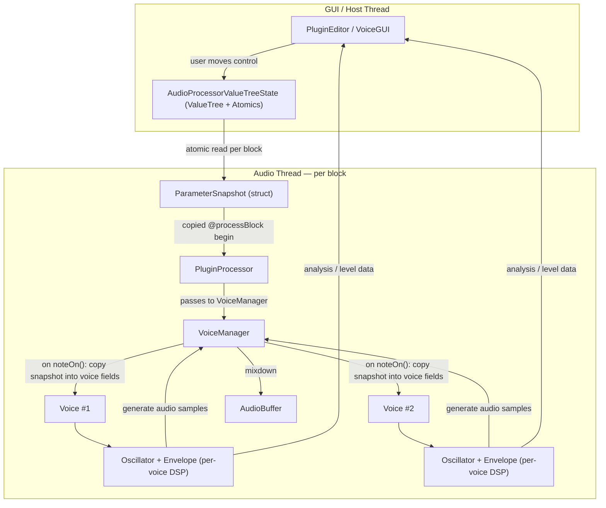
```mermaid
graph TD
    subgraph GUI_Thread["GUI / Host Thread"]
        GUI["PluginEditor / VoiceGUI"]
        APVTS["AudioProcessorValueTreeState (ValueTree + Atomics)"]
    end

    subgraph Audio_Thread["Audio Thread — per block"]
        PROC["PluginProcessor"]
        SNAP["ParameterSnapshot (struct)"]
        VM["VoiceManager"]
        V1["Voice #1"]
        V2["Voice #2"]
        DSP1["Oscillator + Envelope (per-voice DSP)"]
        DSP2["Oscillator + Envelope (per-voice DSP)"]
        BUFFER["AudioBuffer<float>"]
    end

    %% Connections
    GUI -- "user moves control" --> APVTS
    APVTS -- "atomic<float> read per block" --> SNAP
    SNAP -- "copied @processBlock begin" --> PROC
    PROC -- "passes to VoiceManager" --> VM
    VM -- "on noteOn(): copy snapshot into voice fields" --> V1
    VM -- "on noteOn(): copy snapshot into voice fields" --> V2
    V1 --> DSP1
    V2 --> DSP2
    DSP1 -- "generate audio samples" --> VM
    DSP2 -- "generate audio samples" --> VM
    VM -->|mixdown| BUFFER

    %% Visualization feedback
    DSP1 -- "analysis / level data" --> GUI
    DSP2 -- "analysis / level data" --> GUI
```

### Runtime Context — Host Environments

JUCE plugins always run *inside a host*, which owns the real-time audio loop and the message (GUI) thread.  
Depending on how the plugin is built or launched, the *host* can be:

1. a **DAW** such as FL Studio or Logic (VST3/AU),
2. the **JUCE Standalone wrapper** (self-hosted executable),
3. a **custom CLI runner** that instantiates the DSP directly.

All three call the same `PluginProcessor` and optional `PluginEditor`,  
but differ in *who owns the main loop* and *who calls `processBlock()`*.

#### Initialization / Shutdown Sequence

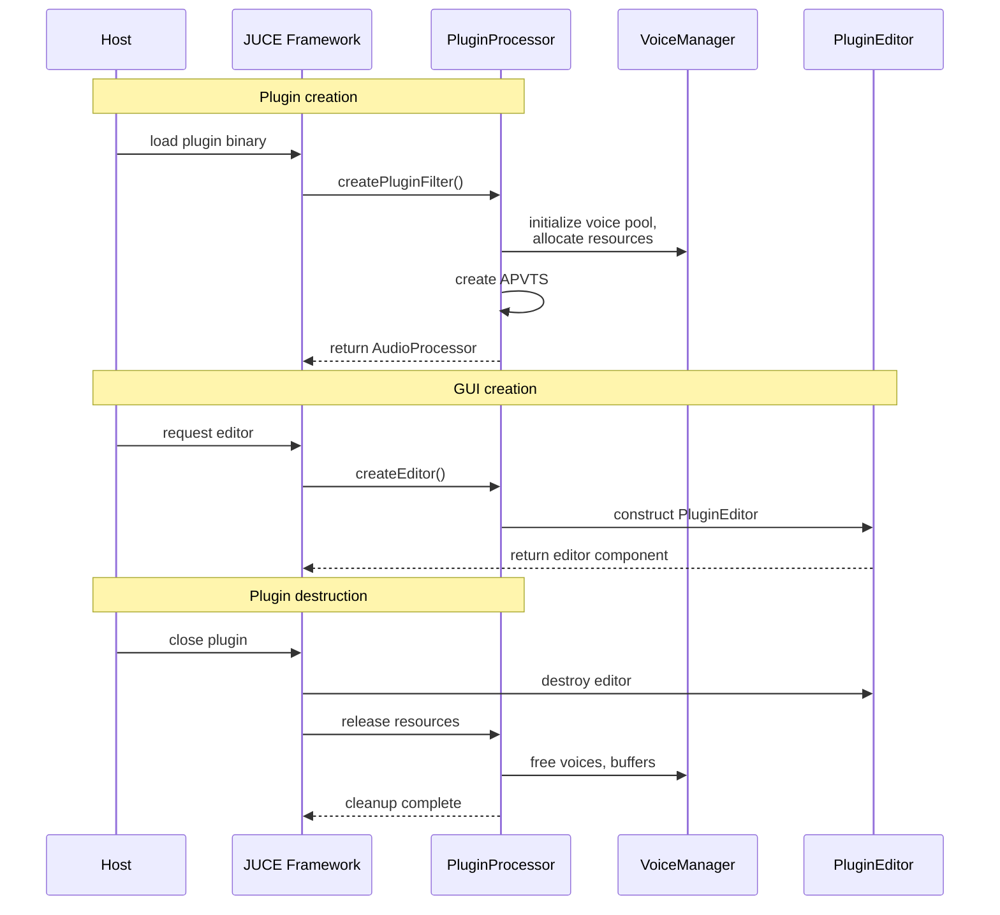
```mermaid
sequenceDiagram
participant Host as Host
participant JUCE as JUCE Framework
participant Processor as PluginProcessor
participant VM as VoiceManager
participant GUI as PluginEditor

Note over Host,Processor: Plugin creation
Host->>JUCE: load plugin binary
JUCE->>Processor: createPluginFilter()
Processor->>VM: initialize voice pool,<br/>allocate resources
Processor->>Processor: create APVTS
Processor-->>JUCE: return AudioProcessor

Note over Host,GUI: GUI creation
Host->>JUCE: request editor
JUCE->>Processor: createEditor()
Processor->>GUI: construct PluginEditor
GUI-->>JUCE: return editor component

Note over Host,Processor: Plugin destruction
Host->>JUCE: close plugin
JUCE->>GUI: destroy editor
JUCE->>Processor: release resources
Processor->>VM: free voices, buffers
Processor-->>JUCE: cleanup complete
```

#### Host responsibilities

| Environment | Who owns main loop | What JUCE does | Typical entry point |
|--------------|--------------------|----------------|---------------------|
| **DAW Host (e.g. FL Studio)** | The DAW’s engine | JUCE runs *inside* the plugin process, handling `AudioProcessor` + GUI layers | `processBlock()` called by host |
| **JUCE Standalone** | JUCE itself | JUCE provides audio + MIDI devices and runs its own threads | `StandaloneFilterWindow` |
| **CLI Runner (Custom)** | Your `main()` | You instantiate `PluginProcessor` manually, feed MIDI/buffers, render to file | `PluginProcessor::processBlock()` |

#### Conceptual layering

```text
       [DAW Host] → calls → [JUCE Plugin Framework] → [PluginProcessor → DSP]
[Standalone Host] → calls → [JUCE Plugin Framework] → [PluginProcessor → DSP]
     [CLI Runner] → calls → [JUCE Plugin Framework] → [PluginProcessor → DSP]
```

### Module Dependencies

JUCE’s build system (through `juce_add_plugin`) always builds at least one binary that must contain a function:
```cpp
juce::AudioProcessor* JUCE_CALLTYPE createPluginFilter();
```
That function’s only job is to construct an instance of the `AudioProcessor` subclass. If it doesn’t exist, the final linker stage (for both Standalone and VST3 targets) fails, because JUCE’s internal client code calls:
```cpp
extern juce::AudioProcessor* JUCE_CALLTYPE createPluginFilter();
```
A JUCE plugin doesn’t have to do anything musically in order to build, but this symbol must exist.

```text
Host (DAW / Standalone / CLI)
 ├─ calls → PluginProcessor.cpp  ← (real-time audio loop)
 │             ├─ owns AudioProcessorValueTreeState (APVTS — global State Tree)
 │             ├─ uses VoiceManager.h        (Factory / Pool)
 │             │     ├─ injects per-voice parameter views from APVTS
 │             │     └─ creates modular Voice subclasses (e.g. VoiceA, VoiceB, VoiceC)
 │             │           ├─ uses Oscillator*.h (Concrete Strategies)
 │             │           └─ uses Envelope*.h   (Concrete Strategies)
 │             ├─ uses SmoothedValue (Decorator for per-parameter smoothing)
 │             ├─ updates APVTS from MIDI CC, Host automation, and GUI events
 │             └─ exposes state changes to PluginEditor.cpp and VoiceGUI modules (Observers)
 │
 └─ calls → PluginEditor.cpp  ← (GUI thread / Active Object)
               ├─ observes APVTS via parameter attachments (Observer)
               ├─ spawns per-Voice GUI panels bound to APVTS subtrees
               ├─ reflects current parameter values in GUI controls (knobs, sliders, meters)
               └─ sends user interactions → APVTS (State Tree) → PluginProcessor (two-way binding)
```

## Sound generation


### `Note On` event: *When key is pressed on MIDI controller*

#### A1: `Note On` — External Interface
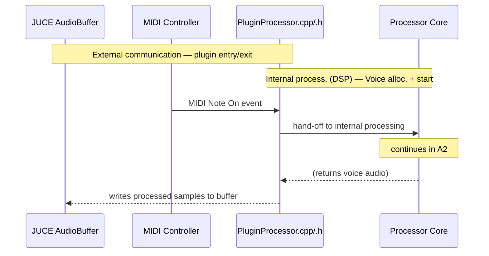
```mermaid
sequenceDiagram
participant Buffer as JUCE AudioBuffer
participant MIDI as MIDI Controller
participant PluginProcessor as PluginProcessor.cpp/.h
participant Ref as Processor Core

Note over Buffer,PluginProcessor: External communication — plugin entry/exit
Note over PluginProcessor,Ref: Internal process. (DSP) — Voice alloc. + start
MIDI->>PluginProcessor: MIDI Note On event
PluginProcessor->>Ref: hand-off to internal processing
Note over Ref: continues in A2
Ref-->>PluginProcessor: (returns voice audio)
PluginProcessor-->>Buffer: writes processed samples to buffer
```

Continues in: [A2: `Note On` — Internal Processing (DSP)](#a2-note-on--internal-processing-dsp)

#### A2: `Note On` — Internal Processing (DSP)
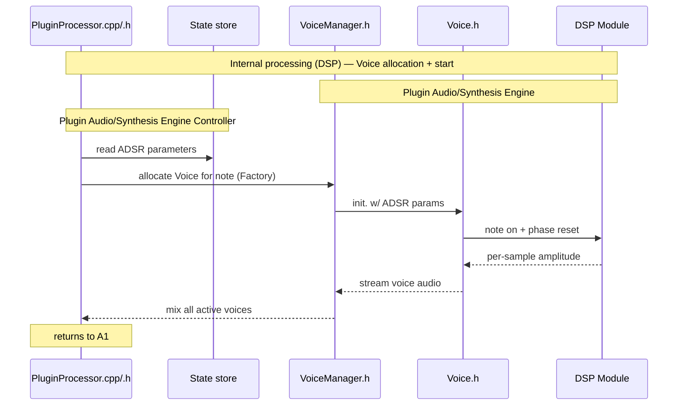
```mermaid
sequenceDiagram
participant PluginProcessor as PluginProcessor.cpp/.h
participant ValueTree as State store
participant VoiceManager as VoiceManager.h
participant Voice as Voice.h
participant DSP as DSP Module

Note over PluginProcessor,DSP: Internal processing (DSP) — Voice allocation + start
Note over VoiceManager,DSP: Plugin Audio/Synthesis Engine
Note over PluginProcessor,ValueTree: Plugin Audio/Synthesis Engine Controller
PluginProcessor->>ValueTree: read ADSR parameters
PluginProcessor->>VoiceManager: allocate Voice for note (Factory)
VoiceManager->>Voice: init. w/ ADSR params
Voice->>DSP: note on + phase reset
DSP-->>Voice: per-sample amplitude
Voice-->>VoiceManager: stream voice audio
VoiceManager-->>PluginProcessor: mix all active voices
Note over PluginProcessor: returns to A1
```

Returns to: [A1: `Note On` — External Interface](#a1-note-on--external-interface)

### `Note Off` event: *When key is lifted up on MIDI controller*

#### B1: `Note Off` — External Interface
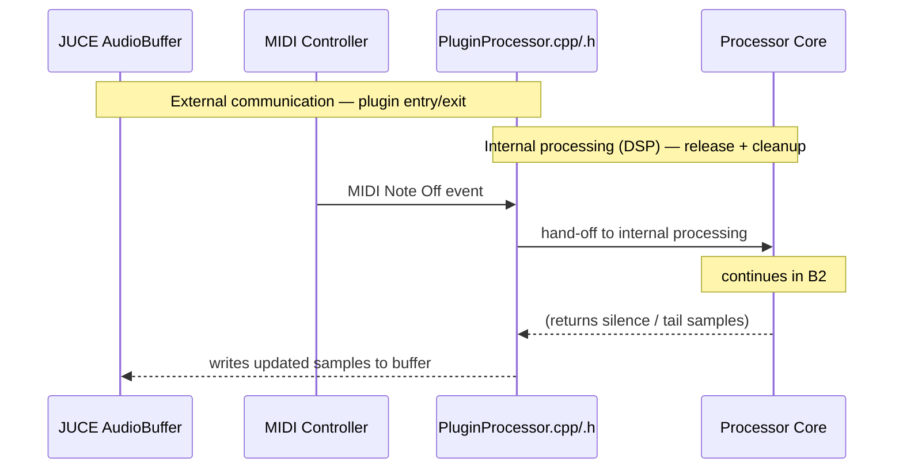
```mermaid
sequenceDiagram
participant Buffer as JUCE AudioBuffer
participant MIDI as MIDI Controller
participant PluginProcessor as PluginProcessor.cpp/.h
participant Ref as Processor Core

Note over Buffer,PluginProcessor: External communication — plugin entry/exit
Note over PluginProcessor,Ref: Internal processing (DSP) — release + cleanup
MIDI->>PluginProcessor: MIDI Note Off event
PluginProcessor->>Ref: hand-off to internal processing
Note over Ref: continues in B2
Ref-->>PluginProcessor: (returns silence / tail samples)
PluginProcessor-->>Buffer: writes updated samples to buffer
```

Continues in: [B2: `Note Off` — Internal Processing (DSP)](#b2-note-off--internal-processing-dsp)

#### B2: `Note Off` — Internal Processing (DSP)

```mermaid
sequenceDiagram
participant PluginProcessor as PluginProcessor.cpp/.h
participant ValueTree as State store
participant VoiceManager as VoiceManager.h
participant Voice as Voice.h
participant DSP as Envelope.h + Oscillator.h

Note over PluginProcessor,DSP: Internal processing (DSP) — release + cleanup
Note over VoiceManager,DSP: Plugin Audio/Synthesis Engine
Note over PluginProcessor,ValueTree: Plugin Audio/Synthesis Engine Controller
PluginProcessor->>ValueTree: read release parameter
PluginProcessor->>VoiceManager: locate Voice for note
VoiceManager->>Voice: trigger note release
Voice->>DSP: ADSR gets fade/sample
DSP-->>Voice: output decaying waveform
Voice-->>VoiceManager: signal inactive
VoiceManager-->>PluginProcessor: remove finished voice
Note over PluginProcessor: returns to B1
```

Returns to: [B1: `Note Off` — External Interface](#b1-note-off--external-interface)

## Sound modulation

### `Parameter Update` event: *Triggered by GUI, MIDI CC, or Host Automation*

Parameter updates may originate from:
- user interaction in a **Voice-specific GUI** (e.g. `FMVoiceGUI`, `GranularVoiceGUI`),
- incoming **MIDI controller data**, or
- **DAW automation envelopes**.

All of these sources converge in the **AudioProcessorValueTreeState** (APVTS, *State Store*),  
which the `PluginProcessor` owns. The APVTS synchronizes parameter values  
across threads and provides smoothed transitions for the DSP engine.

Each Voice module and its corresponding GUI read/write parameters through  
a *namespaced parameter group* in the APVTS (e.g. `fm_attack`, `granular_density`).  
This allows multiple voice types and GUIs to coexist modularly without interfering  
with one another.

---

#### C1: Parameter Update — External Interface
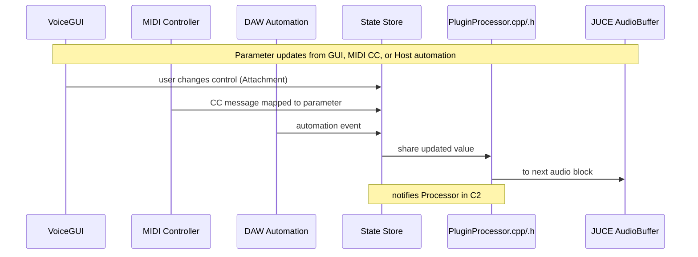
```mermaid
sequenceDiagram
participant GUI as VoiceGUI
participant MIDI as MIDI Controller
participant Host as DAW Automation
participant APVTS as State Store
participant Processor as PluginProcessor.cpp/.h
participant Buffer as JUCE AudioBuffer

Note over GUI,Buffer: Parameter updates from GUI, MIDI CC, or Host automation
GUI->>APVTS: user changes control (Attachment)
MIDI->>APVTS: CC message mapped to parameter
Host->>APVTS: automation event
APVTS->>Processor: share updated value
Processor->>Buffer: to next audio block
Note over APVTS,Processor: notifies Processor in C2
```

At this point, the Processor has received updated parameter values from the APVTS. See [C2: Parameter Update — Internal Processing](#c2-parameter-update--internal-processing) for how those values are applied within the DSP engine.

#### C2: Parameter Update — Internal Processing
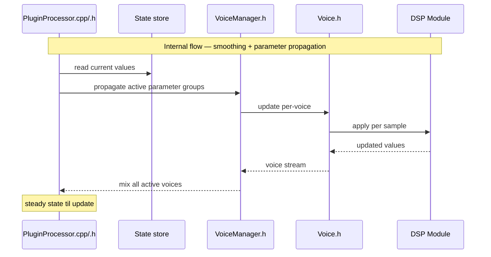
```mermaid
sequenceDiagram
participant Processor as PluginProcessor.cpp/.h
participant APVTS as State store
participant VoiceManager as VoiceManager.h
participant Voice as Voice.h
participant DSP as DSP Module

Note over Processor,DSP: Internal flow — smoothing + parameter propagation
Processor->>APVTS: read current values
Processor->>VoiceManager: propagate active parameter groups
VoiceManager->>Voice: update per-voice
Voice->>DSP: apply per sample
DSP-->>Voice: updated values
Voice-->>VoiceManager: voice stream
VoiceManager-->>Processor: mix all active voices
Note over Processor: steady state til update

```

Returns to: [C1: Parameter Update — External Interface](#c1-parameter-update--external-interface)

#### Parameter Smoothing Sequence
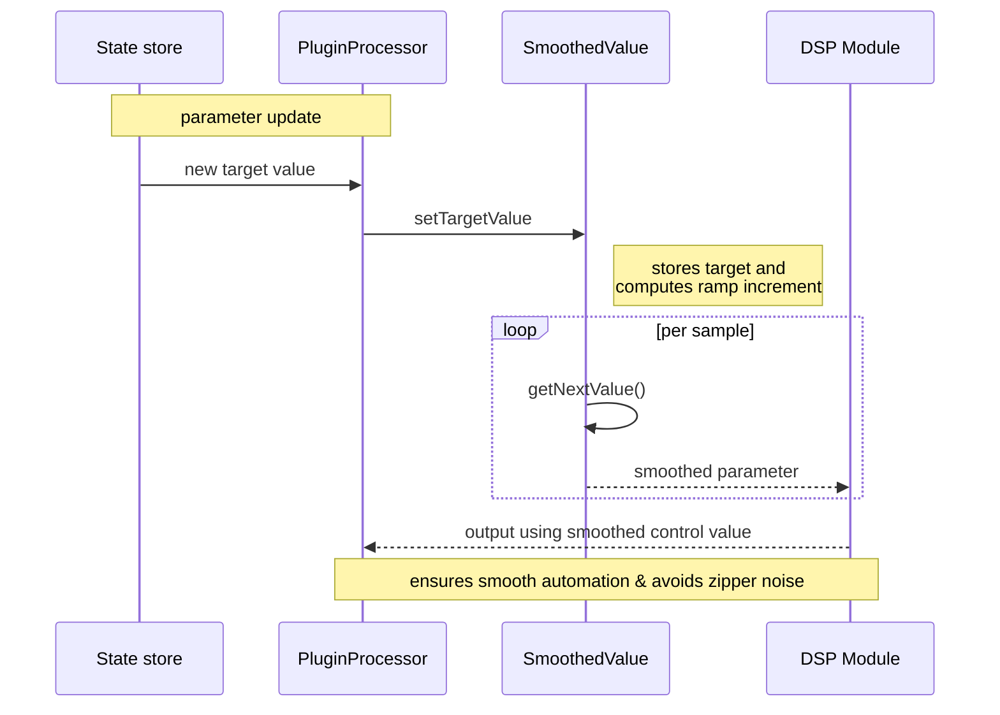
```mermaid
sequenceDiagram
participant APVTS as State store
participant Proc as PluginProcessor
participant Smooth as SmoothedValue
participant DSP as DSP Module

Note over APVTS,Proc: parameter update
APVTS->>Proc: new target value
Proc->>Smooth: setTargetValue
Note right of Smooth: stores target and<br/>computes ramp increment
loop per sample
    Smooth->>Smooth: getNextValue()
    Smooth-->>DSP: smoothed parameter
end
DSP-->>Proc: output using smoothed control value
Note over Proc,DSP: ensures smooth automation & avoids zipper noise
```

| Field / Concept             | Type / Example                                  | Time Scale                  | Description                                                                                                                                      |
| --------------------------- | ----------------------------------------------- | --------------------------- | ------------------------------------------------------------------------------------------------------------------------------------------------ |
| **Target Value**            | `float target` (e.g. 0.75 for gain)             | Block-level                 | The most recent parameter value read from the APVTS atomics at the start of `processBlock()` and passed into `SmoothedValue::setTargetValue()` . |
| **Current Value**           | `float current`                                 | Sample-level                | The internal state of `SmoothedValue`; updated every `getNextValue()` call to interpolate between `current` and `target`.                        |
| **Ramp Length**             | `int numSamples` or `float seconds`             | Configurable (e.g. 5–20 ms) | Duration of the smoothing transition; controls perceived responsiveness vs stability.                                                            |
| **Smoothing Type**          | `Linear` (default) | `Exponential` (log-domain) | Per-sample                  | Interpolation curve type. Linear suits amplitude; Exponential suits frequency or dB parameters.                                                  |
| **Update Rate**             | 1 × per sample                                  | Realtime                    | `SmoothedValue::getNextValue()` is called inside the DSP inner loop, producing one interpolated value per sample.                                |
| **Block Boundary Behavior** | Deterministic                                   | Block-level                 | If the ramp is incomplete when the next block begins, `SmoothedValue` continues seamlessly into the next block—no zipper discontinuities.        |
| **Thread Safety**           | Lock-free                                       | Always                      | All target updates occur on the audio thread; GUI writes to APVTS atomics only. No mutexes or allocations.                                       |
| **Typical Uses**            | Gain, cutoff, pitch bend, envelope depth        | —                           | Prevents pops/clicks when automation or GUI moves rapidly.                                                                                       |


#### C3: Voice GUI Switching — Dynamic Binding Between GUI and DSP
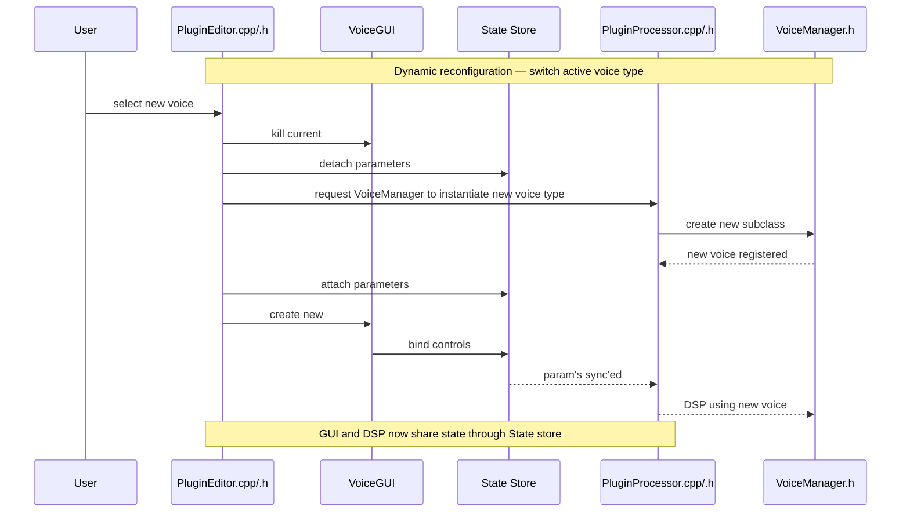
```mermaid
sequenceDiagram
participant User as User
participant GUIHost as PluginEditor.cpp/.h
participant VoiceGUI as VoiceGUI
participant APVTS as State Store
participant Processor as PluginProcessor.cpp/.h
participant VoiceManager as VoiceManager.h

Note over GUIHost,VoiceManager: Dynamic reconfiguration — switch active voice type

User->>GUIHost: select new voice
GUIHost->>VoiceGUI: kill current
GUIHost->>APVTS: detach parameters
GUIHost->>Processor: request VoiceManager to instantiate new voice type
Processor->>VoiceManager: create new subclass
VoiceManager-->>Processor: new voice registered
GUIHost->>APVTS: attach parameters
GUIHost->>VoiceGUI: create new
VoiceGUI->>APVTS: bind controls
APVTS-->>Processor: param's sync'ed
Processor-->>VoiceManager: DSP using new voice
Note over GUIHost,Processor: GUI and DSP now share state through State store
```

## Parameter Propagation (Voice Lifecycle)

### ?

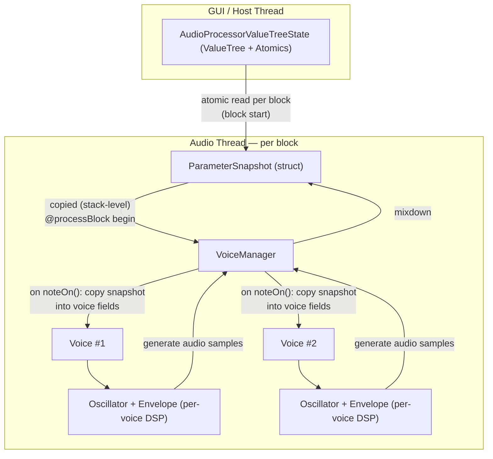
```mermaid
graph TD
    subgraph GUI_Thread["GUI / Host Thread"]
        APVTS["AudioProcessorValueTreeState (ValueTree + Atomics)"]
    end

    subgraph Audio_Thread["Audio Thread — per block"]
        SNAP["ParameterSnapshot (struct)"]
        VM["VoiceManager"]
        V1["Voice #1"]
        V2["Voice #2"]
        DSP1["Oscillator + Envelope (per-voice DSP)"]
        DSP2["Oscillator + Envelope (per-voice DSP)"]
    end

    %% connections
    APVTS -- "atomic<float> read per block\n(block start)" --> SNAP
    SNAP -- "copied (stack-level)\n@processBlock begin" --> VM
    VM -- "on noteOn(): copy snapshot\ninto voice fields" --> V1
    VM -- "on noteOn(): copy snapshot\ninto voice fields" --> V2
    V1 --> DSP1
    V2 --> DSP2
    DSP1 -- "generate audio samples" --> VM
    DSP2 -- "generate audio samples" --> VM
    VM -->|mixdown| SNAP
```

### Where copies happen
| Copy Boundary                  | Source → Target                            | Frequency           | Purpose                             |
| ------------------------------ | ------------------------------------------ | ------------------- | ----------------------------------- |
| **A. APVTS → Snapshot**        | GUI thread atomics → audio-thread struct   | once per block      | Create real-time-safe snapshot      |
| **B. Snapshot → VoiceManager** | stack → manager member                     | once per block      | Pass consistent params to allocator |
| **C. VoiceManager → Voice**    | snapshot → voice local copy                | once per noteOn     | Freeze per-note parameters          |
| **D. Voice → DSP modules**     | voice fields → oscillator/envelope members | once per note start | Initialize actual DSP behavior      |

### Time Boundaries
| Layer          | Time Scale      | Data Ownership           | Notes                   |
| -------------- | --------------- | ------------------------ | ----------------------- |
| GUI / Host     | Asynchronous    | `APVTS` (shared atomics) | user tweaks, automation |
| AudioProcessor | Block-granular  | `ParameterSnapshot`      | stable per-block        |
| VoiceManager   | Block-granular  | `currentParams` copy     | consistent allocator    |
| Voice / DSP    | Sample-granular | local floats             | realtime, no locks      |

### Parameter Snapshot vs. MIDI Events (within a single block)
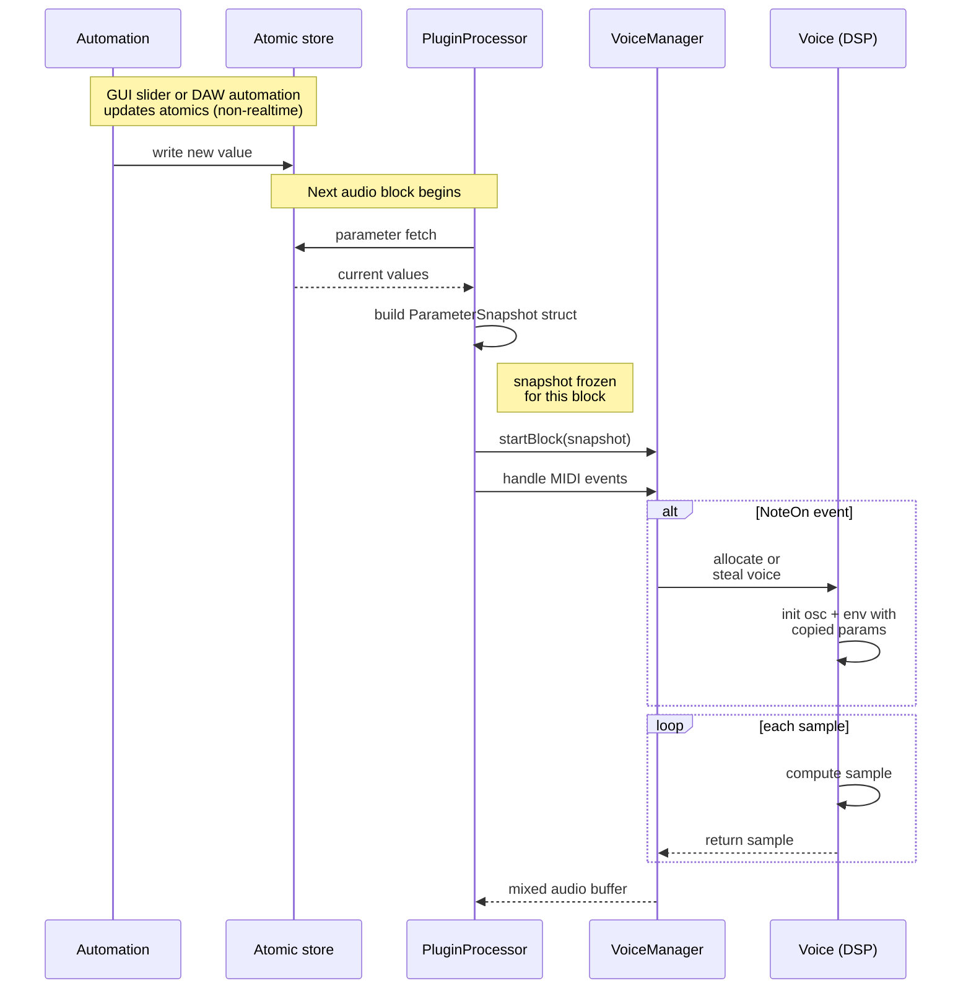
```mermaid
sequenceDiagram
    participant GUI as Automation
    participant APVTS as Atomic store
    participant Proc as PluginProcessor
    participant VM as VoiceManager
    participant V as Voice (DSP)

    Note over GUI,APVTS: GUI slider or DAW automation<br/>updates atomics (non-realtime)
    GUI->>APVTS: write new value

    Note over APVTS,Proc: Next audio block begins
    Proc->>APVTS: parameter fetch
    APVTS-->>Proc: current values
    Proc->>Proc: build ParameterSnapshot struct

    Note right of Proc: snapshot frozen<br/>for this block

    Proc->>VM: startBlock(snapshot)
    Proc->>VM: handle MIDI events

    alt NoteOn event
        VM->>V: allocate or<br/>steal voice
        V->>V: init osc + env with<br/>copied params
    end

    loop each sample
        V->>V: compute sample
        V-->>VM: return sample
    end

    VM-->>Proc: mixed audio buffer
```

### Parameter Update Pipeline

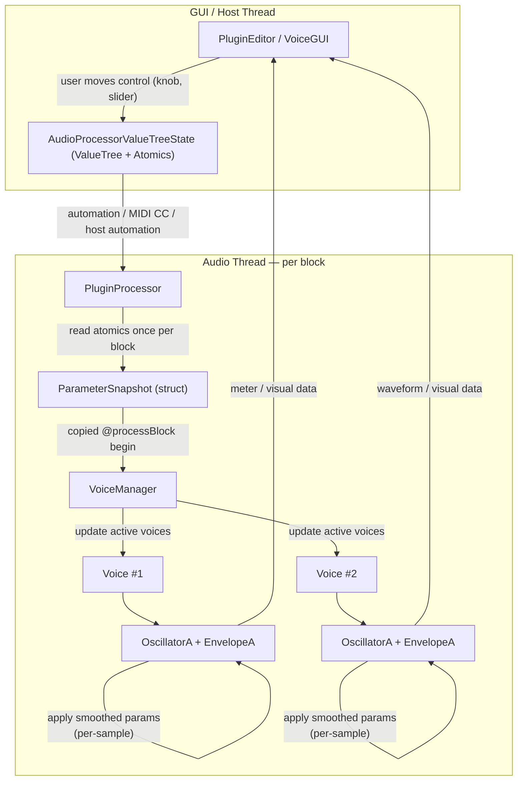
```mermaid
graph TD
    subgraph GUI_Thread["GUI / Host Thread"]
        GUI["PluginEditor / VoiceGUI"]
        APVTS["AudioProcessorValueTreeState (ValueTree + Atomics)"]
    end

    subgraph Audio_Thread["Audio Thread — per block"]
        PROC["PluginProcessor"]
        SNAP["ParameterSnapshot (struct)"]
        VM["VoiceManager"]
        V1["Voice #1"]
        V2["Voice #2"]
        DSP1["OscillatorA + EnvelopeA"]
        DSP2["OscillatorA + EnvelopeA"]
    end

    %% Control flow from GUI/Host
    GUI -- "user moves control (knob, slider)" --> APVTS
    APVTS -- "automation / MIDI CC / host automation" --> PROC
    PROC -- "read atomics once per block" --> SNAP
    SNAP -- "copied @processBlock begin" --> VM
    VM -- "update active voices" --> V1
    VM -- "update active voices" --> V2
    V1 --> DSP1
    V2 --> DSP2

    %% Internal propagation
    DSP1 -- "apply smoothed params\n(per-sample)" --> DSP1
    DSP2 -- "apply smoothed params\n(per-sample)" --> DSP2

    %% Feedback reflection
    DSP1 -- "meter / visual data" --> GUI
    DSP2 -- "waveform / visual data" --> GUI
```

## GUI

##
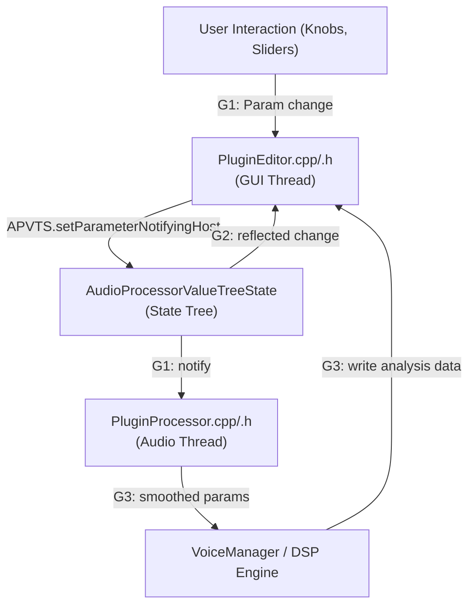
```mermaid
flowchart TD
    User["User Interaction (Knobs, Sliders)"]
    GUI["PluginEditor.cpp/.h<br/>(GUI Thread)"]
    APVTS["AudioProcessorValueTreeState<br/>(State Tree)"]
    Processor["PluginProcessor.cpp/.h<br/>(Audio Thread)"]
    DSP["VoiceManager / DSP Engine"]

    User -->|"G1: Param change"| GUI
    GUI -->|"APVTS.setParameterNotifyingHost"| APVTS
    APVTS -->|"G1: notify"| Processor
    Processor -->|"G3: smoothed params"| DSP
    DSP -->|"G3: write analysis data"| GUI
    APVTS -->|"G2: reflected change"| GUI
```

#### G1: Parameter Update (User → Processor)

When the user touches a knob, the GUI sends the change safely to the processor via the AudioProcessorValueTreeState (APVTS), which synchronizes with automation and the real-time thread.

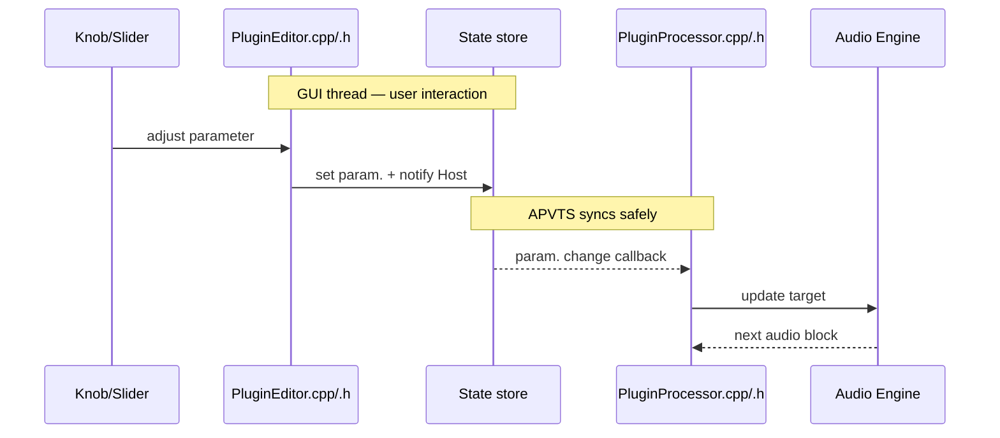
```mermaid
sequenceDiagram
participant User as Knob/Slider
participant GUI as PluginEditor.cpp/.h
participant APVTS as State store
participant Processor as PluginProcessor.cpp/.h
participant DSP as Audio Engine

Note over GUI,APVTS: GUI thread — user interaction
User->>GUI: adjust parameter
GUI->>APVTS: set param. + notify Host
Note over APVTS,Processor: APVTS syncs safely
APVTS-->>Processor: param. change callback
Processor->>DSP: update target
DSP-->>Processor: next audio block
```

➡ This is the standard control path — it’s what makes knobs automate and record properly in the host.

#### G2: Parameter Reflection (Processor → GUI)

When automation or MIDI CC changes a parameter on the audio thread, the GUI must reflect the new value. JUCE’s APVTS handles this automatically if controls are attached via SliderAttachment, ButtonAttachment, etc.

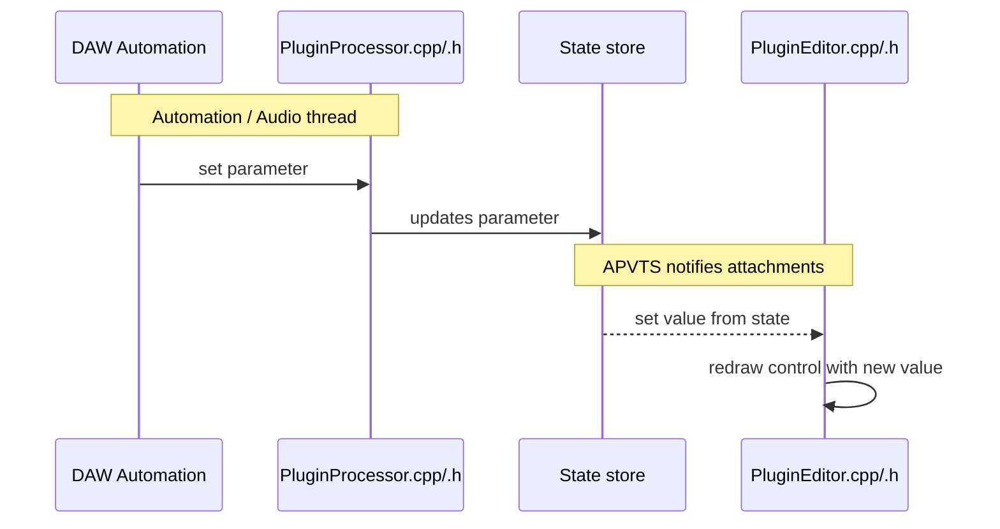
```mermaid
sequenceDiagram
participant Host as DAW Automation
participant Processor as PluginProcessor.cpp/.h
participant APVTS as State store
participant GUI as PluginEditor.cpp/.h

Note over Host,Processor: Automation / Audio thread
Host->>Processor: set parameter
Processor->>APVTS: updates parameter
Note over APVTS,GUI: APVTS notifies attachments
APVTS-->>GUI: set value from state
GUI->>GUI: redraw control with new value
```

➡ This is the reverse flow — parameters change in the engine, and the GUI follows.

#### G3: Visualization Feedback Loop
This process handles continuous data visualization (waveform preview, envelopes, levels, etc.).
Because the GUI thread can’t directly read DSP memory, this requires a shared lock-free buffer or atomic handoff.

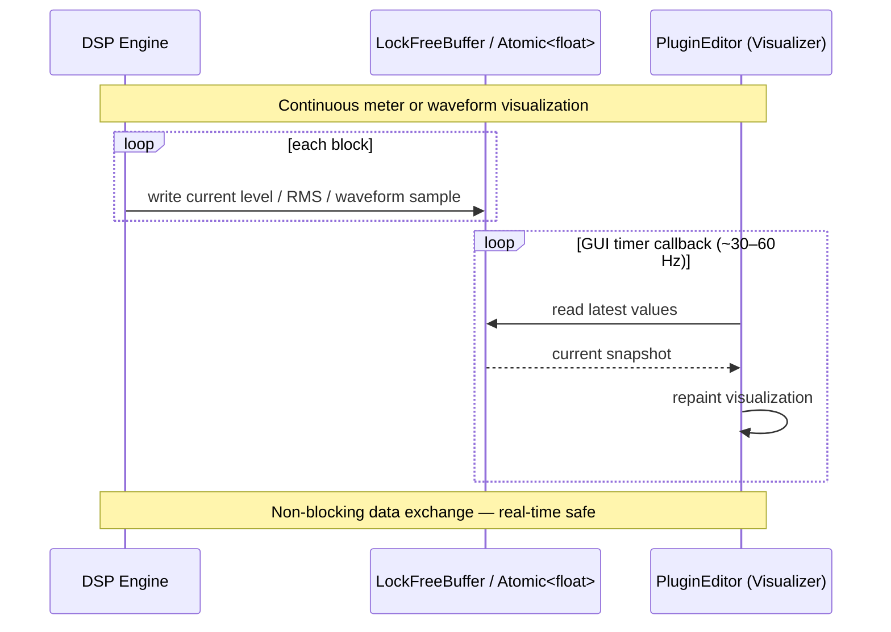
```mermaid
sequenceDiagram
participant DSP as DSP Engine
participant Shared as LockFreeBuffer / Atomic<float>
participant GUI as PluginEditor (Visualizer)

Note over DSP,GUI: Continuous meter or waveform visualization
loop each block
    DSP->>Shared: write current level / RMS / waveform sample
end
loop GUI timer callback (~30–60 Hz)
    GUI->>Shared: read latest values
    Shared-->>GUI: current snapshot
    GUI->>GUI: repaint visualization
end
Note over DSP,GUI: Non-blocking data exchange — real-time safe
```

➡ This is custom logic, separate from the APVTS — used for meters, scopes, oscillators, etc.

## Voice types

### Voice type instance

- Created for one active MIDI note.

- Receives its base pitch (noteNumber → Hz) and the current VoiceA parameters from the snapshot.

- Applies them like:
```makefile
frequency = midiNoteToHz(noteNumber) * snap.voiceA.oscFreqRatio
envelope.setAttack(snap.voiceA.envAttack)
envelope.setRelease(snap.voiceA.envRelease)
```

- After noteOn, it keeps those values frozen until noteOff.

### Per voice type data flow

#### Overview
```
[GUI sliders for VoiceA]
        │
        ▼
[APVTS: "voiceA_*" parameter group]
        │  (atomic<float> values, global per voice-type)
        ▼
[ParameterSnapshot]  ← frozen once per audio block
        │
        ▼
[VoiceManager]
        │  (owns all active VoiceA instances)
        ▼
[VoiceA instances]
        │  (each note pressed creates one)
        ▼
[OscillatorA / EnvelopeA]
```

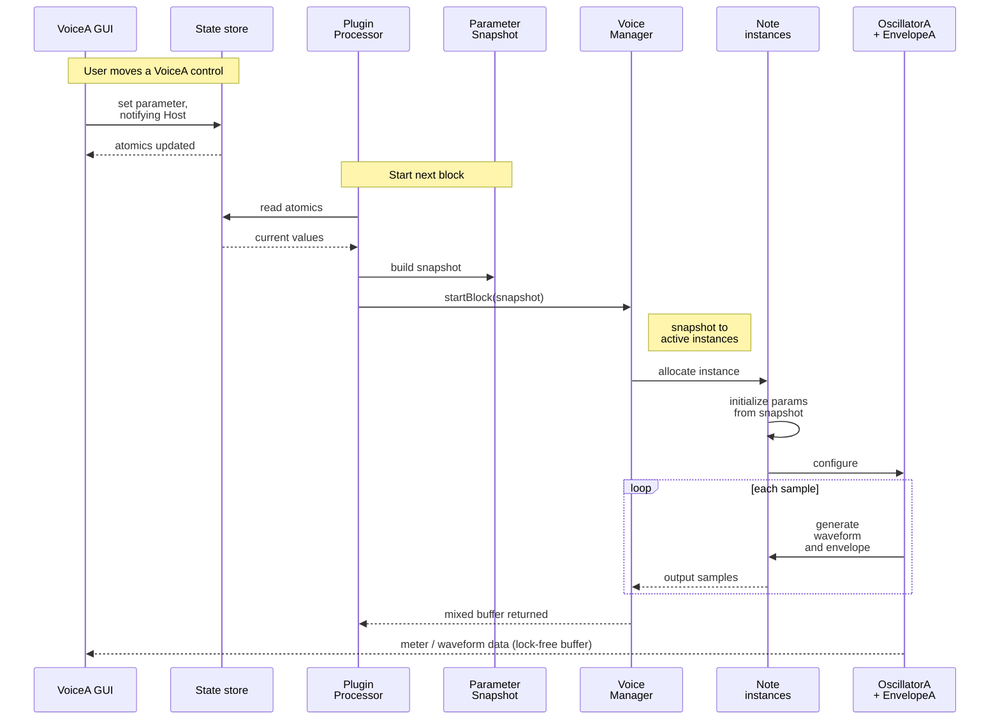
```mermaid
sequenceDiagram
    participant GUI as VoiceA GUI
    participant APVTS as State store
    participant Proc as Plugin<br/>Processor
    participant Snap as Parameter<br/>Snapshot
    participant VM as Voice<br/>Manager
    participant VA as Note<br/>instances
    participant DSP as OscillatorA<br/>+ EnvelopeA

    %% GUI side
    Note over GUI,APVTS: User moves a VoiceA control
    GUI->>APVTS: set parameter,<br/>notifying Host
    APVTS-->>GUI: atomics updated

    %% Block boundary
    Note over Proc,Snap: Start next block
    Proc->>APVTS: read atomics
    APVTS-->>Proc: current values
    Proc->>Snap: build snapshot

    %% VoiceManager receives snapshot
    Proc->>VM: startBlock(snapshot)
    Note right of VM: snapshot to<br/>active instances

    %% Handling MIDI notes
    VM->>VA: allocate instance
    VA->>VA: initialize params<br/>from snapshot
    VA->>DSP: configure

    %% Audio generation
    loop each sample
        DSP->>VA: generate<br/>waveform<br/>and envelope
        VA-->>VM: output samples
    end
    VM-->>Proc: mixed buffer returned

    %% Optional GUI feedback
    DSP-->>GUI: meter / waveform data (lock-free buffer)
```

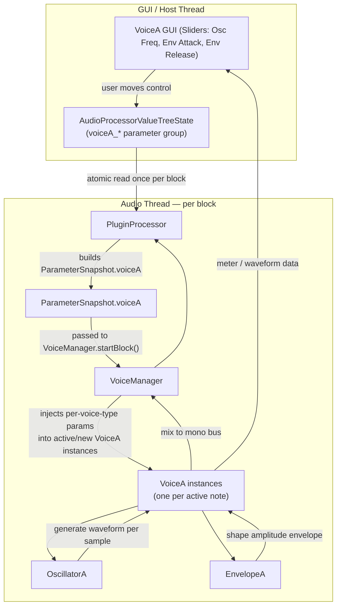
```mermaid
graph TD
    subgraph GUI_Thread["GUI / Host Thread"]
        GUI["VoiceA GUI (Sliders: Osc Freq, Env Attack, Env Release)"]
        APVTS["AudioProcessorValueTreeState<br/>(voiceA_* parameter group)"]
    end

    subgraph Audio_Thread["Audio Thread — per block"]
        PROC["PluginProcessor"]
        SNAP["ParameterSnapshot.voiceA"]
        VM["VoiceManager"]
        VA["VoiceA instances<br/>(one per active note)"]
        OSC["OscillatorA"]
        ENV["EnvelopeA"]
    end

    %% Control flow from GUI to DSP
    GUI -- "user moves control" --> APVTS
    APVTS -- "atomic<float> read once per block" --> PROC
    PROC -- "builds ParameterSnapshot.voiceA" --> SNAP
    SNAP -- "passed to VoiceManager.startBlock()" --> VM
    VM -- "injects per-voice-type params<br/>into active/new VoiceA instances" --> VA
    VA --> OSC
    VA --> ENV

    %% Audio generation
    OSC -- "generate waveform per sample" --> VA
    ENV -- "shape amplitude envelope" --> VA
    VA -- "mix to mono bus" --> VM
    VM --> PROC

    %% Optional feedback
    VA -- "meter / waveform data" --> GUI
```

## Processor

```mermaid
sequenceDiagram
participant Host
participant PluginProcessor
participant APVTS as State store
participant VM as VoiceManager
participant Buffer as AudioBuffer<float>

Host->>PluginProcessor: processBlock(buffer, midi)
PluginProcessor->>APVTS: read atomics
PluginProcessor->>PluginProcessor: build ParameterSnapshot
PluginProcessor->>VM: startBlock(snapshot)
PluginProcessor->>VM: handle MIDI events (note on/off)
PluginProcessor->>VM: render(buffer, numSamples)
VM-->>Buffer: to buffer
PluginProcessor-->>Host: return processed block
```