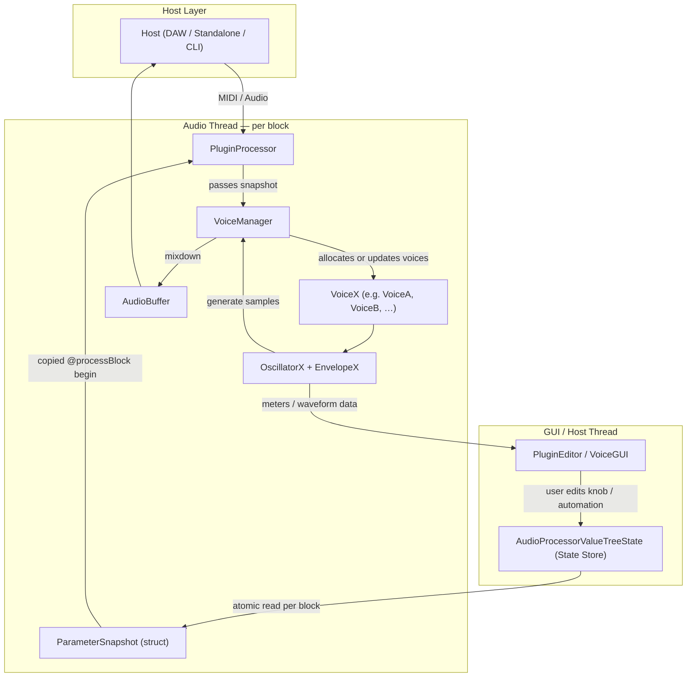
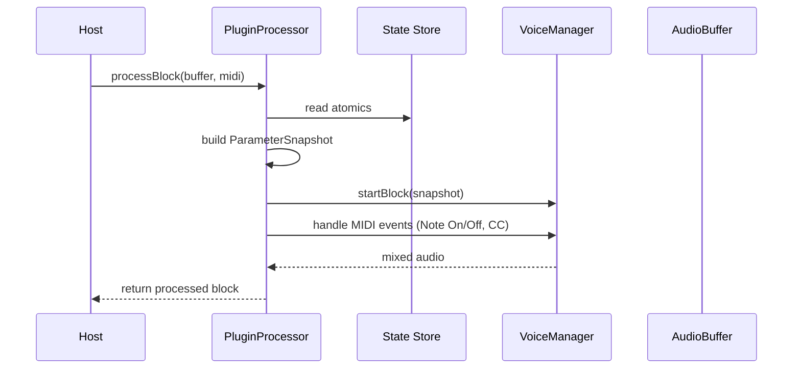
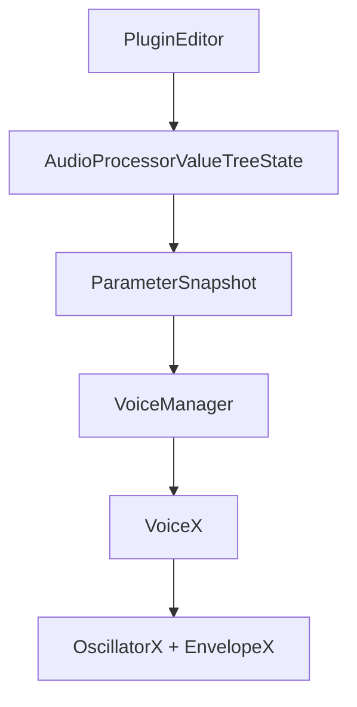
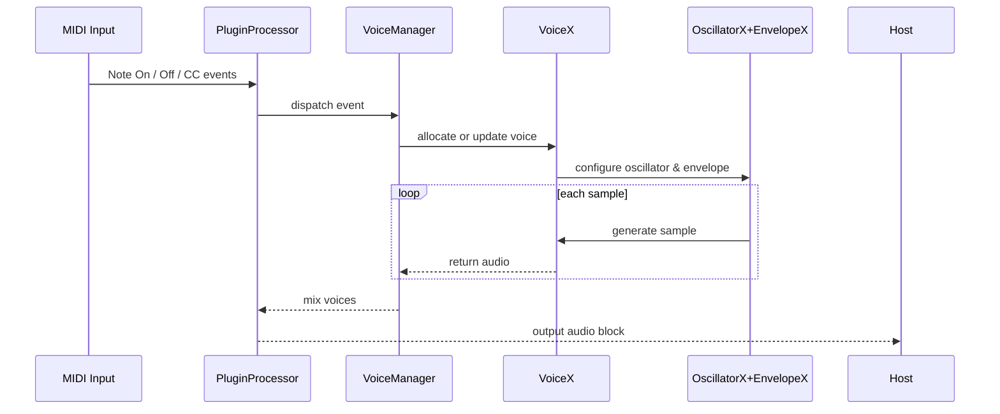
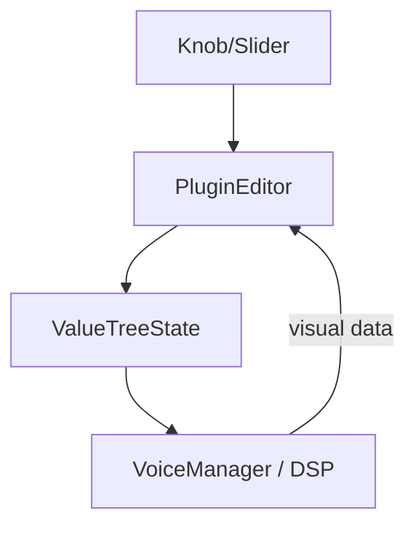

# Architecture Overview

**MIDIControl001 — Modular Voice Architecture**  
This document describes the *VoiceX* synthesis architecture as implemented in MIDIControl001.  
It supersedes earlier internal design notes and unifies them into a concise, public-facing overview.  
Each Voice type (VoiceA, VoiceB, …) implements the same lifecycle and interface, but may use different
oscillator and envelope strategies (OscillatorX, EnvelopeX). This modularity allows new timbres and
controller mappings while preserving a common synth core.

---

## 1. System Overview



---

## 2. Runtime Context — Host Environments

JUCE plugins run *inside a host* that owns the real-time audio loop and GUI thread.  
Depending on the build target, the host can be:

| Environment | Who owns main loop | What JUCE does | Entry point |
|--------------|--------------------|----------------|--------------|
| **DAW (VST3/AU)** | The DAW engine | Runs plugin process, calling `processBlock()` | Host callbacks |
| **Standalone** | JUCE | Manages audio & MIDI devices, runs own threads | `StandaloneFilterWindow` |
| **CLI Runner** | User app | Instantiates `PluginProcessor`, feeds buffers | `processBlock()` |

Initialization follows the standard JUCE pattern: host loads the plugin, JUCE constructs the `PluginProcessor`, and voices are prepared by the `VoiceManager`.  
Shutdown reverses this cleanly, ensuring no dangling voices or buffers.

---

## 3. Core Components

### 3.1 PluginProcessor

- Owns the `AudioProcessorValueTreeState` (**APVTS**) for parameters.  
- Reads all atomics once per audio block → builds a `ParameterSnapshot`.  
- Handles **MIDI input** (Note On/Off, CC).  
- Delegates DSP to the **VoiceManager**.  
- Writes mixed audio back to the host buffer.  



---

### 3.2 VoiceManager

- Manages a pool of `VoiceX` instances (e.g., VoiceA, VoiceB).  
- Selects an inactive voice or recycles the quietest active one.  
- On `NoteOn`, copies current `ParameterSnapshot` + persistent CC state into the new voice.  
- On `NoteOff`, triggers release and cleanup.  
- Maintains a clickless global gain controller for polyphonic smoothness.  

**Persistent Controls:**  
Certain global CCs (like master volume/mix) persist across voices; others (attack, release, detune) are cached per block.  

```text
VoiceManager responsibilities:
- Voice allocation and reuse
- Parameter propagation (per block)
- Persistent CC cache
- Polyphonic summation and adaptive RMS control
```

---

### 3.3 VoiceX (VoiceA, VoiceB, …)

Each `VoiceX` implements a consistent interface:
```cpp
void prepare(double sampleRate);
void noteOn(const ParameterSnapshot&, int midiNote, float velocity);
void noteOff();
void render(float* buffer, int numSamples);
void handleController(int cc, float norm);
void updateParams(const VoiceParams& vp);
bool isActive() const;
```
- `noteOn()` derives base frequency from MIDI note (`440 * 2^((note-69)/12)`) and applies optional detune.  
- `OscillatorX` generates waveforms; `EnvelopeX` shapes amplitude.  
- Each note runs independently and contributes to the mixdown in `VoiceManager::render()`.  

---

## 4. Parameter Flow



| Boundary | Source → Target | Frequency | Purpose |
|-----------|----------------|------------|----------|
| **A. GUI → APVTS** | User or automation → shared atomics | async | Control change |
| **B. APVTS → Snapshot** | Atomics → struct | once per block | Real‑time safety |
| **C. Snapshot → VoiceManager** | Struct → internal copy | once per block | Consistency |
| **D. VoiceManager → VoiceX** | Snapshot → local | at noteOn | Freeze params per note |
| **E. VoiceX → DSP modules** | Voice fields → Osc/Env | per sample | Real‑time processing |

---

## 5. Note Lifecycle



---

## 6. Parameter Smoothing

- `SmoothedValue` ensures sample-level interpolation for automation and CC changes.  
- Prevents zipper noise or clicks from fast parameter updates.  
- Ramp durations configurable per parameter (e.g., 5–20 ms).  

| Field | Description |
|--------|-------------|
| Target | Most recent param value from APVTS |
| Current | Internal interpolated value |
| Ramp | Duration for smoothing |
| Thread safety | Lock-free, real-time safe |

---

## 7. GUI / DSP Synchronization

- GUI controls bind to APVTS parameters via `SliderAttachment` etc.  
- When automation or CC changes a parameter, the GUI reflects it automatically.  
- Visual meters and oscilloscopes use a lock-free shared buffer for data transfer (not APVTS).  



---

## 8. Extending to New Voices

The synth is designed to scale:

| Module | Role | Replaceable? | Example |
|---------|------|--------------|---------|
| `VoiceX` | Per-note logic | ✅ | VoiceA → VoiceB |
| `OscillatorX` | Waveform generation | ✅ | Sine → PWM / FM |
| `EnvelopeX` | Amplitude or modulation shape | ✅ | ASR → ADSR / exp |
| `VoiceManager` | Allocation & mixing | Shared | usually stable |
| `PluginProcessor` | Integration w/ host | Shared | parameter/midi logic |

Adding a new `VoiceB` only requires subclassing `BaseVoice` and plugging it into the manager.

---

## 9. Summary

**Core guarantees:**
- Real-time safe parameter access via snapshots.  
- Independent polyphonic voices with persistent control state.  
- Modular `VoiceX` model supporting arbitrary oscillators/envelopes.  
- JUCE-compliant threading and host synchronization.  
- Extensible design for new synthesis models without breaking architecture.

---

*(End)*
