# Sound generation

## Highlevel picture of sound generation via MIDI controller

### Flowchart View — Signal Path (Top-down)

## `Note On` event: *When key is pressed on MIDI controller*

### A1: `Note On` — External Interface

Continues in: [A2: `Note On` — Internal Processing](#a2-`note on`--internal-processing)

### A2: `Note On` — Internal Processing

Returns to: [A1: `Note On` — External Interface](#a1-`note on`--external-interface)

## `Note Off` event: *When key is lifted up on MIDI controller*

### B1: `Note Off` — External Interface

```mermaid
sequenceDiagram
participant MIDI as MIDI Controller (External)
participant PluginProcessor as PluginProcessor.cpp/.h (Interface)
participant Ref as `Note Off` Internal Processing
participant Buffer as JUCE AudioBuffer<float>

Note over MIDI,Buffer: External communication — plugin entry/exit
MIDI->>PluginProcessor: MIDI Note Off event
PluginProcessor->>Ref: hand-off to internal processing
Note over Ref: continues in B2 (see link below)
Ref-->>PluginProcessor: (see next diagram)
PluginProcessor-->>Buffer: writes updated samples to buffer
```

Continues in: [B2: `Note Off` — Internal Processing](#b2-`note off`--internal-processing)

### B2: `Note Off` — Internal Processing

Returns to: [B1: `Note Off` — External Interface](#b1-`note off`--external-interface)

# Sound modulation

## Highlevel picture of sound modulation via MIDI controller

### Flowchart View — Parameter Signal Path (Top-down)

## `Parameter Update` event: *[...]*

### C1: Parameter Update — External Interface

Continues in: [C2: Parameter Update — Internal Processing](#c2-parameter-update--internal-processing)

### C2: Parameter Update — Internal Processing

Returns to: [C1: Parameter Update — External Interface](#c1-parameter-update--external-interface)